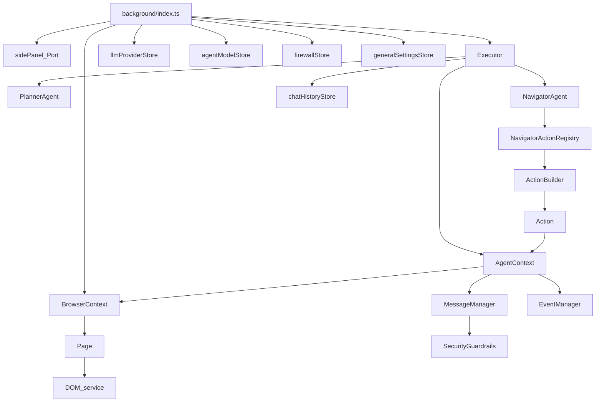

### Core 实现类清单（带定位）

> 本页聚焦 core_ext 范围内“谁创建谁、谁持有谁、依赖如何注入”。关键时序详见 flow 文档。

### 1) 顶层入口：Background

- **Background 入口模块**：`chrome-extension/src/background/index.ts`
  - **创建者**：Chrome MV3 runtime
  - **持有/管理**：
    - `browserContext: BrowserContext`（单例）
    - `currentExecutor: Executor | null`
    - `currentPort: chrome.runtime.Port | null`
  - **依赖注入点**：
    - `setupExecutor(taskId, task, browserContext)`：把 storage/settings/LLM/firwall 注入到 Executor
    - `subscribeToExecutorEvents(executor)`：把 executor 的事件桥接到 side-panel port

### 2) 浏览器控制层（Puppeteer + BrowserContext）

- **`BrowserContext`**：`chrome-extension/src/background/browser/context.ts`
  - 负责管理当前 tab 与一组“已 attach 的 Page”
  - 依赖：`Page`、URL firewall（`isUrlAllowed`）

- **`Page`**：`chrome-extension/src/background/browser/page.ts`
  - 负责对单 tab 建立 Puppeteer/CDP 连接，并提供浏览器操作、截图、DOM state 获取、点击/输入等能力
  - 关键依赖：
    - Puppeteer：`ExtensionTransport.connectTab(tabId)` + `connect()`
    - DOM service：`browser/dom/service.ts`（构建 DOM tree、scroll info、remove highlights）
    - ClickableElementProcessor（哈希与去重）：`browser/dom/clickable/service.ts`

### 3) DOM 表示与历史（用于 selector 稳定性/回放）

- **`DOMElementNode` / `DOMTextNode`**：`chrome-extension/src/background/browser/dom/views.ts`
  - DOM tree 的结构化表示（包含 xpath、attributes、highlightIndex、viewport/page 坐标、isNew 等）

- **`HistoryTreeProcessor` + `DOMHistoryElement`**：
  - `browser/dom/history/service.ts`：hash/比较/查找
  - `browser/dom/history/view.ts`：history element 数据结构

### 4) 执行编排：Executor + Agents

- **`Executor`**：`chrome-extension/src/background/agent/executor.ts`
  - 构造时组装：`MessageManager`、`EventManager`、`AgentContext`、`ActionBuilder`、`NavigatorAgent`、`PlannerAgent`
  - 执行循环：Planner 周期性规划 + Navigator 每步执行

- **`AgentContext`**：`chrome-extension/src/background/agent/types.ts`
  - 持有 AbortController、BrowserContext、MessageManager、EventManager、options、history、actionResults 等

- **`PlannerAgent`**：`chrome-extension/src/background/agent/agents/planner.ts`
  - 依赖：LangChain ChatModel，输出 zod schema（done/next_steps/final_answer/...）

- **`NavigatorAgent` + `NavigatorActionRegistry`**：`chrome-extension/src/background/agent/agents/navigator.ts`
  - registry 持有 actions，并为模型动态生成输出 schema
  - agent 负责 structured output 调用与错误分类（auth/forbidden/badrequest/abort/extensionConflict）

### 5) Actions（工具/动作执行）

- **`Action` / `ActionBuilder`**：`chrome-extension/src/background/agent/actions/builder.ts`
  - Action：schema 校验 + handler 执行
  - ActionBuilder：基于 `AgentContext` 构建默认 actions（goToUrl/click/input/scroll/...）

### 6) Messages / Events / Guardrails

- **`MessageManager`**：`chrome-extension/src/background/agent/messages/service.ts`
  - 管理 LLM 输入消息历史、tool call 占位、plan/state message 插入
  - 依赖 `messages/utils.ts` 进行 prompt 注入防护与附件封装

- **`EventManager` / `AgentEvent` / `ExecutionState`**：
  - `agent/event/manager.ts`：订阅/广播
  - `agent/event/types.ts`：ExecutionState 枚举（task/step/act）

- **`SecurityGuardrails`**：`chrome-extension/src/background/services/guardrails/index.ts`
  - `messages/utils.ts` 会用 `guardrails.sanitize()` 清理 untrusted content

### 7) Storage（以 background 实际使用为主）

- **LLM providers**：`packages/storage/lib/settings/llmProviders.ts`（`llmProviderStore`）
- **Agent models**：`packages/storage/lib/settings/agentModels.ts`（`agentModelStore`）
- **Firewall**：`packages/storage/lib/settings/firewall.ts`（`firewallStore`）
- **General settings**：`packages/storage/lib/settings/generalSettings.ts`（`generalSettingsStore`）
- **Analytics settings**：`packages/storage/lib/settings/analyticsSettings.ts`（`analyticsSettingsStore`）
- **Chat history**：`packages/storage/lib/chat/history.ts`（`chatHistoryStore`）

---

### 生命周期与依赖注入（从 `background/index.ts` 视角）

- **初始化（Background 加载）**
  - 创建 `browserContext = new BrowserContext({})`
  - 初始化 analytics，并订阅 `analyticsSettingsStore.subscribe(...)`
  - 注册 `chrome.runtime.onConnect` 等事件监听

- **接到 `new_task`**
  - `currentExecutor = await setupExecutor(taskId, task, browserContext)`
    - 从 storage 读取 providers/models/firewall/generalSettings
    - `createChatModel(providerConfig, modelConfig)` 构建 LangChain chat model
    - 将 firewall/generalSettings 写入 browserContext config
    - `new Executor(task, taskId, browserContext, navigatorLLM, { plannerLLM, agentOptions, generalSettings })`
  - `subscribeToExecutorEvents(currentExecutor)`：将 `ExecutionState` 事件转发到 side-panel port
  - `await currentExecutor.execute()`

- **任务终态自动清理**
  - `subscribeToExecutorEvents` 检测到 `TASK_OK|TASK_FAIL|TASK_CANCEL` 会 `await currentExecutor.cleanup()`

---

### 依赖对象图（Mermaid）

