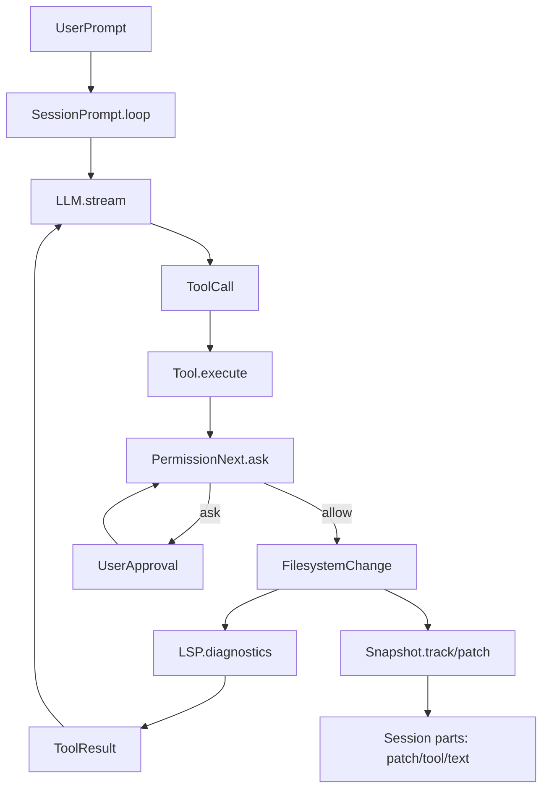

## 端到端总览：OpenCode 的“编码能力”是如何工作的

### 核心结论
OpenCode 并不让模型“直接输出最终文件内容然后落盘”，而是让模型输出 **结构化的 Tool Calls**（read/grep/edit/write/patch…）。运行时负责：
- 把工具暴露给模型
- 在本地执行工具
- 在执行前做权限/路径/一致性校验
- 将结果回灌给模型，形成“生成 → 执行 → 诊断 → 再生成”的闭环

### 端到端数据流

### 关键模块定位
- **会话循环与流式 parts**：`.refer/.sources/opencode/packages/opencode/src/session/prompt.ts`、`.refer/.sources/opencode/packages/opencode/src/session/processor.ts`
- **工具注册与暴露给模型**：`.refer/.sources/opencode/packages/opencode/src/tool/registry.ts`
- **写入工具链**：`.refer/.sources/opencode/packages/opencode/src/tool/{edit,write,patch}.ts`、`.refer/.sources/opencode/packages/opencode/src/patch/index.ts`
- **权限系统**：`.refer/.sources/opencode/packages/opencode/src/permission/next.ts`
- **路径越界保护**：`.refer/.sources/opencode/packages/opencode/src/tool/external-directory.ts`
- **一致性/并发写锁**：`.refer/.sources/opencode/packages/opencode/src/file/time.ts`
- **质量反馈（LSP）**：`.refer/.sources/opencode/packages/opencode/src/lsp/index.ts`
- **可回滚（快照）**：`.refer/.sources/opencode/packages/opencode/src/snapshot/index.ts`
- **扩展（插件与 MCP）**：`.refer/.sources/opencode/packages/opencode/src/plugin/index.ts`、`.refer/.sources/opencode/packages/opencode/src/mcp/index.ts`

### 为什么这样设计
- **安全**：所有写入/外部目录访问都要过权限闸门，用户可审阅 diff。
- **可控**：通过“先读后写 + mtime 校验”避免基于旧上下文写脏。
- **可观测**：每个 tool call 都是结构化记录，便于 UI 展示与回放。
- **可迭代**：写完立即跑 LSP 诊断，把错误反馈给模型继续修。
