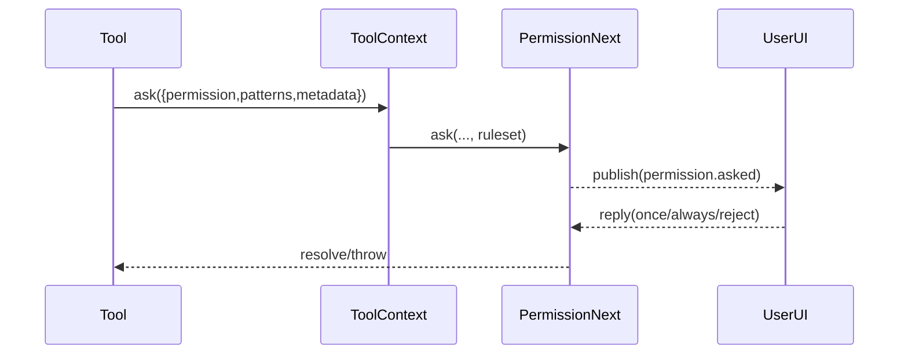

## Permission：工具执行前的授权闸门（PermissionNext）

### 这篇讲什么
解释 OpenCode 如何在工具执行前做“允许/拒绝/询问”，以及规则集（agent/session）如何决定工具可用性。

### 关键文件
- `.refer/.sources/opencode/packages/opencode/src/permission/next.ts`
- `.refer/.sources/opencode/packages/opencode/src/session/prompt.ts`（统一注入 `ctx.ask`）

### PermissionNext 的核心抽象
- **Rule**：`{ permission, pattern, action }`，其中 action ∈ `{ allow, deny, ask }`
- **Ruleset**：Rule 数组，来自：
  - agent 权限（`agent.permission`）
  - session 权限（`session.permission`）
  - 以及（概念上）历史批准缓存（目前仅内存，注释提示未来落盘）

### ask 的执行语义
`PermissionNext.ask({ permission, patterns, always, metadata, ... , ruleset })` 会对 `patterns` 逐个评估：
1. `evaluate(permission, pattern, ruleset, approved)` 找到最后一个匹配规则（last match wins）
2. 若 action=deny：抛 `DeniedError`
3. 若 action=ask：创建 pending request，发布 `permission.asked`，等待用户 `reply`
4. 若 action=allow：直接放行

### “编辑类工具”统一映射为 edit
`PermissionNext.disabled` 把 `edit/write/patch/multiedit` 统一归类为 `edit` permission：
- 这使 UI/配置可以“一键禁用所有写入能力”。

### 工具上下文如何调用权限
会话层在 `SessionPrompt.resolveTools` 里构造统一 `ctx.ask(req)`：
- 将 tool 自己传入的 req 与 `sessionID`、合并 ruleset 一起交给 `PermissionNext.ask`

因此：
- **工具定义权限粒度**（permission 名称 + patterns + metadata（diff 等））
- **PermissionNext 决策**（allow/deny/ask）

### 时序图

### 与“编码能力”的关系
编码工具（`edit/write/patch`）在真正落盘前都会把 diff 放入 metadata 并触发 `permission:"edit"`，从而实现“可审阅、可拒绝、可强制询问”。
