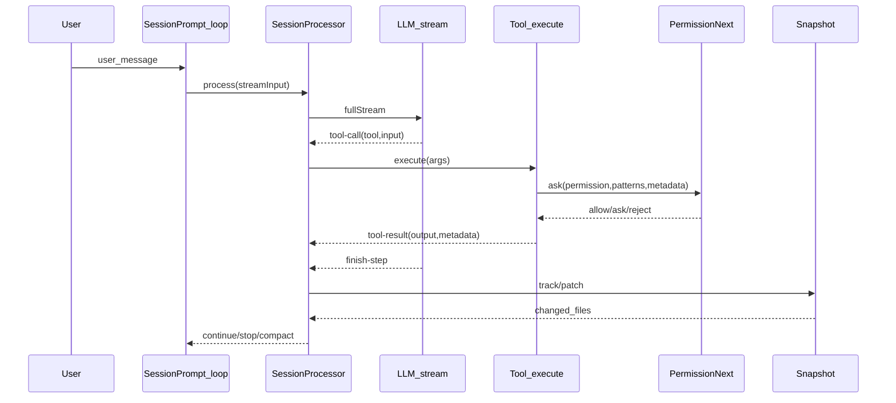

## Session Loop：从用户消息到工具调用的执行循环

### 这篇讲什么
这篇聚焦 OpenCode 在一次会话中如何循环驱动模型、接收 tool call、执行工具、记录 parts，并在需要时停止/压缩上下文。

### 关键文件
- `.refer/.sources/opencode/packages/opencode/src/session/prompt.ts`
- `.refer/.sources/opencode/packages/opencode/src/session/processor.ts`

### 顶层循环（SessionPrompt.loop）
`SessionPrompt.loop(sessionID)` 是主循环：
- 从消息流里找到最近的 user/assistant（含 finish 状态）
- 插入必要的 reminders（plan/build 切换提示、max steps 等）
- 解析并注入 tools（见 `resolveTools`）
- 调用 `SessionProcessor.process(...)` 消费 `LLM.stream` 的 fullStream
- 根据结果继续、停止，或触发 compaction

### 流式 parts 记录（SessionProcessor.process）
OpenCode 会将模型输出拆成结构化 parts（便于 UI 展示与可追踪）：
- `text`：普通回复
- `reasoning`：推理流（如 provider 支持）
- `tool`：工具调用（pending → running → completed/error）
- `step-start/step-finish`：每个 step 的边界
- `patch`：本 step 的文件变更摘要（由 Snapshot 生成）

它在处理 `LLM.stream(...).fullStream` 时，关键事件包括：
- `tool-call`：把 tool part 置为 running
- `tool-result`：写入输出与 metadata
- `tool-error`：记录 error，并在 permission/question 拒绝时设置 blocked
- `start-step/finish-step`：触发 `Snapshot.track()` 与 `Snapshot.patch(...)`

### 关键策略
- **Doom loop 检测**：连续多次重复同一 tool+input，会触发特殊权限 `doom_loop`（避免模型陷入死循环调用同一个工具）。
- **阻塞/停止条件**：当用户拒绝权限或 question 被拒绝时，可根据配置决定是否 break loop。
- **Compaction（上下文压缩）**：当 tokens 超阈值时，创建 compaction 任务并在后续循环处理。

### 时序图（精简）

### 与“编码能力”的关系
“编码”发生在工具执行阶段：模型并不直接写文件，而是触发 `edit/write/patch` 等 tool call；会话层负责把每次写入的 diff/诊断/快照变化记录成 parts，再喂回模型形成迭代闭环。
