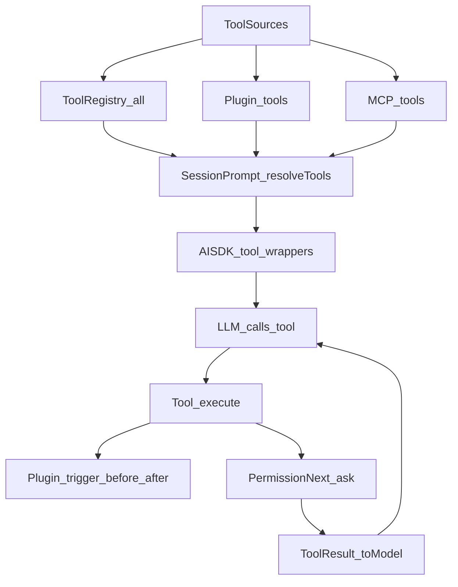

## Tools Resolution：工具如何注册、暴露给模型、以及如何统一加上权限

### 这篇讲什么
解释 OpenCode 如何收集工具（内置 + 插件 + MCP）、把它们转换成模型可调用的 tool，并在执行前统一注入权限闸门与 plugin hooks。

### 关键文件
- `.refer/.sources/opencode/packages/opencode/src/tool/registry.ts`
- `.refer/.sources/opencode/packages/opencode/src/session/prompt.ts`
- `.refer/.sources/opencode/packages/opencode/src/permission/next.ts`
- `.refer/.sources/opencode/packages/opencode/src/mcp/index.ts`
- `.refer/.sources/opencode/packages/opencode/src/plugin/index.ts`

### 工具来源
#### 1) 内置工具
在 `ToolRegistry.all()` 中列出：`read/grep/glob/edit/write/patch/bash/...` 等。

#### 2) 自定义 tools 目录与插件 tool
`ToolRegistry.state` 会扫描 `Config.directories()` 下的 `{tool,tools}/*.{js,ts}`，将其按 namespace 加载成工具；同时加载 `Plugin.list()` 返回的 plugin tool 定义。

#### 3) MCP 工具
`MCP.tools()` 会把已连接的 MCP server 的 tool 列表转换成 AI SDK `dynamicTool`，并以 `server_toolName` 方式命名（会做安全的字符清洗）。

### 暴露给模型：resolveTools
`SessionPrompt.resolveTools(...)` 会把所有工具打包成 AI SDK 的 `tool({...})`：
- 输入 schema：将工具参数（Zod）转 JSONSchema，并做 provider 兼容变换
- execute：执行前/后触发 `Plugin.trigger("tool.execute.before/after")`
- toModelOutput：把 tool 输出规范化为 text 回灌模型

### 统一权限注入（核心）
`resolveTools` 构造统一的 `Tool.Context`，其中 `ctx.ask(req)` 会调用：
- `PermissionNext.ask({ ...req, sessionID, ruleset: merge(agent.permission, session.permission) })`

这意味着：
- **每个工具自己决定要申请什么 permission/patterns/metadata**
- **最终是否放行由 PermissionNext 规则集评估**（allow/deny/ask）
- 对编辑类工具（edit/write/patch/multiedit），权限统一映射为 `edit`（便于一键禁用/允许）。

### MCP 工具的额外保护
对于 MCP 工具，`resolveTools` 包了一层：在真正 `execute` 前先 `ctx.ask({ permission: key, patterns:["*"], always:["*"] })`，确保 MCP 使用也经过授权。

### 总流程图

### 与“编码能力”的关系
编码的“可控性”主要来自这里：工具被统一封装并强制通过 `ctx.ask`，从而实现“模型能改代码，但必须在权限与规则边界内改”。
