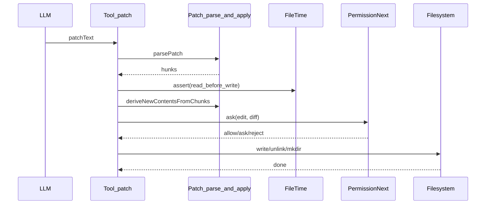

## Tool: patch —— 多文件、上下文感知的补丁应用

### 这篇讲什么
解释 `patch` 工具如何把模型生成的补丁文本解析成文件级变更（add/update/delete/move），并在权限审阅后批量落盘。

### 关键文件
- `.refer/.sources/opencode/packages/opencode/src/tool/patch.ts`
- `.refer/.sources/opencode/packages/opencode/src/patch/index.ts`

### patch 的定位
`patch` 是 **最高带宽** 的写入工具：一次调用可改多个文件，并且 update 不是按行号，而是通过“旧片段匹配 + 可选上下文锚点”来定位替换。

### 数据结构
- **PatchText**：模型输出的原始补丁文本（必须有 `*** Begin Patch`/`*** End Patch`）。
- **Hunk**：每个文件一个 hunk，类型：`add/delete/update`（update 还支持 move）。
- **UpdateFileChunk**：update 的最小单元，包含：
  - `old_lines[]` / `new_lines[]`
  - 可选 `change_context`（`@@` 行）
  - 可选 `is_end_of_file`

### 执行流程
1. **解析**：`Patch.parsePatch(patchText)` → hunks
2. **路径解析/越界检查**：将 hunk.path resolve 到 `Instance.directory` 下，并对 worktree 外路径触发 `external_directory` 权限
3. **读取旧内容 + 一致性校验**：对 update/delete 先 `FileTime.assert(sessionID, filePath)`
4. **计算新内容**：update 时用 `Patch.deriveNewContentsFromChunks(filePath, chunks)` 产出 new content
5. **生成 diff 并请求 edit 权限**：把 total diff 写入 metadata，`ctx.ask({ permission:"edit" ... })`
6. **落盘**：批量 mkdir/write/unlink；发布 file watcher 事件

### 时序图

### 失败模式（常见）
- **补丁格式不合法**：缺失 Begin/End，或 header/chunk 不符合解析器规则。
- **上下文/旧片段找不到**：`seekSequence` 找不到 `old_lines`，会抛错提示“expected lines not found”。
- **未读先写/文件被外部改动**：`FileTime.assert` 失败（必须先 read，且 mtime 不能变）。
- **权限被拒绝**：`PermissionNext.RejectedError/DeniedError`。

### 与 edit/write 的取舍
- **patch**：适合多文件 + 结构化改动；模型输出必须严格遵守补丁格式。
- **edit**：适合局部替换，内置多策略匹配，更宽容。
- **write**：适合整文件生成/覆盖。
