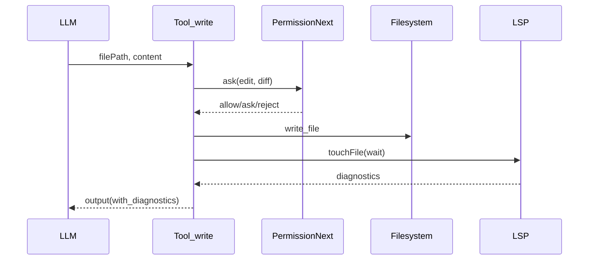

## Tool: write —— 整文件写入 + LSP 诊断反馈

### 这篇讲什么
解释 `write` 工具如何把模型生成的整文件内容安全落盘，并将 diff 与 LSP 诊断结果反馈回模型。

### 关键文件
- `.refer/.sources/opencode/packages/opencode/src/tool/write.ts`
- `.refer/.sources/opencode/packages/opencode/src/tool/edit.ts`（复用 trimDiff）
- `.refer/.sources/opencode/packages/opencode/src/lsp/index.ts`
- `.refer/.sources/opencode/packages/opencode/src/file/time.ts`

### write 的定位
`write` 是“覆盖式写入”：输入 `filePath + content`。
- 适合新文件生成、或确定要覆盖整个文件。
- 与 `edit` 不同：不尝试做定位替换。

### 关键保护
- **路径越界保护**：`assertExternalDirectory`
- **先读后写**：若文件已存在，写前必须 `FileTime.assert(sessionID, filepath)`
- **权限审阅**：生成 unified diff（old vs new），`ctx.ask({ permission:"edit", metadata:{diff} })`

### 质量闭环：写后 LSP 诊断
写完会：
- `LSP.touchFile(filepath, true)` 触发 LSP 更新
- 拉取 `LSP.diagnostics()`
- 将当前文件（以及最多 N 个其他文件）的错误摘要拼进 tool output

这使模型能在下一步看到“写完造成的编译/类型错误”，并继续调用 `edit/patch` 修复。

### 时序图

### 适用场景
- 生成/覆盖配置文件、脚手架文件
- 首次生成大文件（随后用 `edit` 做细调）

### 常见失败模式
- 文件存在但未 read：`FileTime.assert` 报错
- 权限拒绝（diff 审阅未通过）
- 写入后 LSP 大量报错（会被作为提示回灌）
