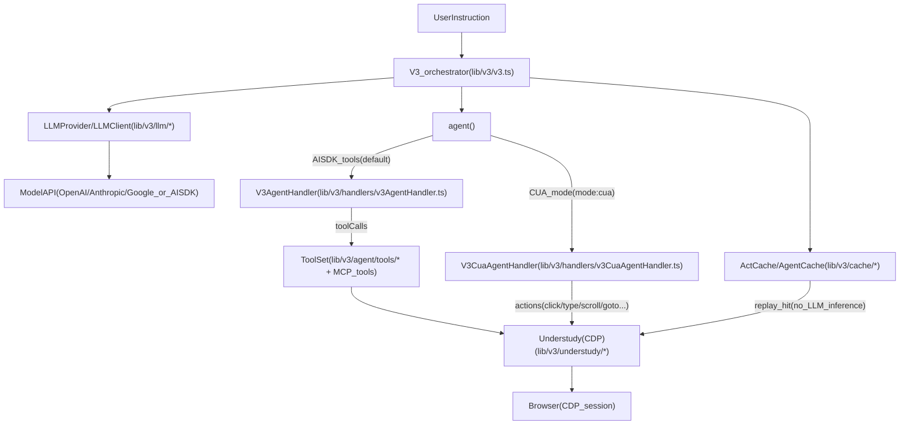
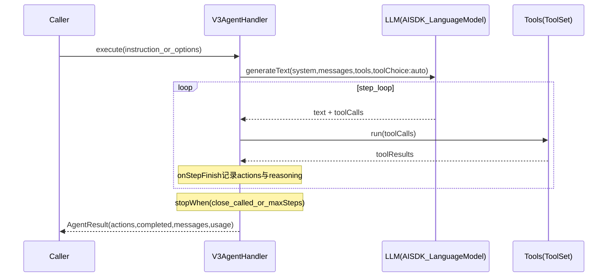

# Stagehand v3：在浏览器自动化工作流中使用大模型（源码导读）

> 目的：把「Stagehand 是否是在工作流中使用大模型的解决思路」这件事，用源码与现有文档证据讲清楚，并提供最短的阅读路径。

## 背景与结论

**结论**：Stagehand（尤其是 v3 的 `lib/v3`）确实是“在浏览器自动化工作流中使用大模型”的工程化方案。

- **工作流（workflow）**：指一串浏览器步骤（单步 `act/extract/observe` 或多步 `agent.execute()`），在运行时根据页面状态逐步推进，直到完成任务。
- **大模型在其中的角色**：
  - 在 **AISDK tools agent** 路径中：模型负责“下一步该调用哪个工具 + 参数是什么”（tool calling / function calling），SDK 执行工具并把结果回填给模型，形成 step loop。
  - 在 **CUA（Computer Use Agent）** 路径中：模型基于截图做“下一步动作”（坐标点击/输入/滚动/跳转等），SDK 执行动作、再截图闭环。
- **工程化补齐（为什么它像工作流而不是一次性 agent）**：通过 `ActCache/AgentCache` 将跑通的动作序列/steps 落盘缓存，后续可 **replay（命中时无需 LLM 推理）**，并在页面变化时触发 **self-healing**（回放失败时再引入 AI 或更新 steps）。

Stagehand 官方 core README 也强调了 “AI-driven -> repeatable workflows / auto-caching / self-healing” 的产品方向（见源码仓库内的 `packages/core/README.md`）。

## 一句话心智模型

- **LLM**：决定“下一步做什么”（工具调用/动作决策）。
- **工具与执行器**：决定“怎么做”（DOM/坐标/Understudy Page/Frame/Locator 等确定性执行）。
- **缓存（Cache）**：决定“下次要不要再问 LLM”（命中就回放，不命中才推理）。

## 总体架构：LLM 驱动 + 可回放工作流

## 工作流执行路径 A：AISDK tools-based agent（默认）

> 入口：`V3.agent()`（未开启 `mode: "cua"` 时）。

### 核心机制：step loop + tool calling

`V3AgentHandler` 会：

- 组装 **system prompt**（包含 URL、任务、mode 约束、可用工具等）
- 组装 **工具集合**：`lib/v3/agent/tools/*` +（可选）MCP integrations tools
- 调用 AI SDK 的 `generateText/streamText`，设置 `toolChoice: "auto"` 与 `onStepFinish`，让模型在多个 step 中持续产出 `toolCalls`，直到触发 `close` 工具或达到 `maxSteps`

### mode（dom / hybrid）对工具的影响

AISDK tools agent 支持用 `mode` 控制“工具形态”：

- **dom（默认）**：偏 DOM/selector 的工具集，强调可重复与可回放
- **hybrid**：在必要时引入坐标/视觉工具（例如更适合复杂 canvas 或 shadow/iframe 场景）

> 更细节的工具裁剪与工具实现请参考现有文档：[`../v3-agent.md`](../v3-agent.md)。

### MCP integrations（仅 AISDK tools agent）

当配置 `agentConfig.integrations` 时，SDK 会把 MCP server 的 tools 合并进 ToolSet，模型就能像调用内建浏览器工具一样调用外部工具。

> 相关逻辑入口在 `lib/v3/mcp/utils.ts`（tools resolution），以及 `V3.prepareAgentExecution()` 中对 tools 的合并。

## 工作流执行路径 B：CUA（Computer Use Agent）

> 入口：`V3.agent({ mode: "cua" })`（旧 `cua: true` 已标记 deprecated）。

### 核心机制：截图 → 决策动作 → 执行 → 再截图

`V3CuaAgentHandler` 会向 `AgentClient` 注入：

- **ScreenshotProvider**：从当前 page 生成 base64 PNG（部分 provider 还需要截图尺寸）
- **ActionHandler**：把 agent 的动作落到 Understudy `Page` 上执行（click/type/scroll/goto/back/forward/drag…），并在动作后再截图回传

同时 `AgentProvider` 会按 modelName / provider 映射到具体 CUA client（OpenAI/Anthropic/Google/Microsoft）。

> CUA 路径细节参见现有文档：[`../v3-agent.md`](../v3-agent.md)。

## 从 AI 驱动到可重复工作流：缓存 / 回放 / 自愈

Stagehand v3 的缓存让“LLM 把流程跑通一次”后，后续可以：

- **cache hit**：直接回放（减少或不需要 LLM 推理）
- **replay 失败**：触发自愈（例如 selector 变化时更新 steps / actions，再写回 cache）

两类缓存：

- **ActCache**：缓存 `act(instruction)` 生成的 actions 序列
- **AgentCache**：缓存 agent 的 replay steps + 最终 `AgentResult`，并兼容 stream

> 细节与 key 设计已在现有文档中展开：[`../v3-cache.md`](../v3-cache.md)。

## 模型接入层：为什么它能切换多家模型

Stagehand v3 把模型接入抽象为：

- `LLMProvider`：根据 `modelName` 路由到不同实现（内建 provider 或 AISDK provider）
- `LLMClient`：统一封装 `generateText/streamText/generateObject` 等接口，供 `act/extract/observe/agent` 的 handler 使用

这让上层工作流逻辑可以“模型无关”，只需改配置 `model`（例如 `openai/gpt-4.1-mini`、`anthropic/claude-*`、或 `aisdk` 支持的其他 provider）。

## 源码索引（建议阅读顺序）

### 最短路径（先理解“LLM 在工作流里怎么跑起来”）

1. `V3` 编排器与对外入口
   - `/Users/sodaabe/codes/coding/mimo/.refer/.sources/stagehand/packages/core/lib/v3/v3.ts`
   - `/Users/sodaabe/codes/coding/mimo/.refer/.sources/stagehand/packages/core/lib/v3/index.ts`
2. AISDK tools agent 主循环
   - `/Users/sodaabe/codes/coding/mimo/.refer/.sources/stagehand/packages/core/lib/v3/handlers/v3AgentHandler.ts`
   - 工具集合：`/Users/sodaabe/codes/coding/mimo/.refer/.sources/stagehand/packages/core/lib/v3/agent/tools/*`
3. CUA agent（截图/动作闭环）
   - `/Users/sodaabe/codes/coding/mimo/.refer/.sources/stagehand/packages/core/lib/v3/handlers/v3CuaAgentHandler.ts`
   - provider 选择：`/Users/sodaabe/codes/coding/mimo/.refer/.sources/stagehand/packages/core/lib/v3/agent/AgentProvider.ts`
4. 缓存/回放（把 AI 驱动变成可重复工作流）
   - `/Users/sodaabe/codes/coding/mimo/.refer/.sources/stagehand/packages/core/lib/v3/cache/ActCache.ts`
   - `/Users/sodaabe/codes/coding/mimo/.refer/.sources/stagehand/packages/core/lib/v3/cache/AgentCache.ts`
   - `/Users/sodaabe/codes/coding/mimo/.refer/.sources/stagehand/packages/core/lib/v3/cache/CacheStorage.ts`
5. 模型接入层
   - `/Users/sodaabe/codes/coding/mimo/.refer/.sources/stagehand/packages/core/lib/v3/llm/LLMProvider.ts`
   - `/Users/sodaabe/codes/coding/mimo/.refer/.sources/stagehand/packages/core/lib/v3/llm/LLMClient.ts`
   - `/Users/sodaabe/codes/coding/mimo/.refer/.sources/stagehand/packages/core/lib/v3/llm/aisdk.ts`

### 与本仓库既有文档的关系（建议交叉阅读）

- 总入口索引（本目录上一级）：[`../README.md`](../README.md)
- Agent（AISDK tools / CUA）更细：[`../v3-agent.md`](../v3-agent.md)
- Cache（ActCache/AgentCache）更细：[`../v3-cache.md`](../v3-cache.md)
- V3 生命周期与分支：[`../v3-overview.md`](../v3-overview.md)
- `act/extract/observe` 主链路：[`../v3-flows-act-extract-observe.md`](../v3-flows-act-extract-observe.md)
