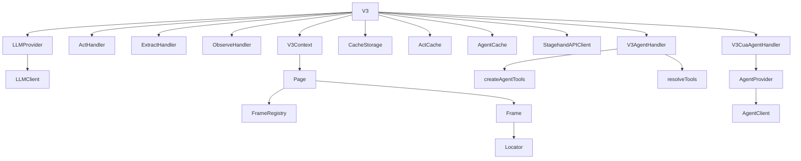
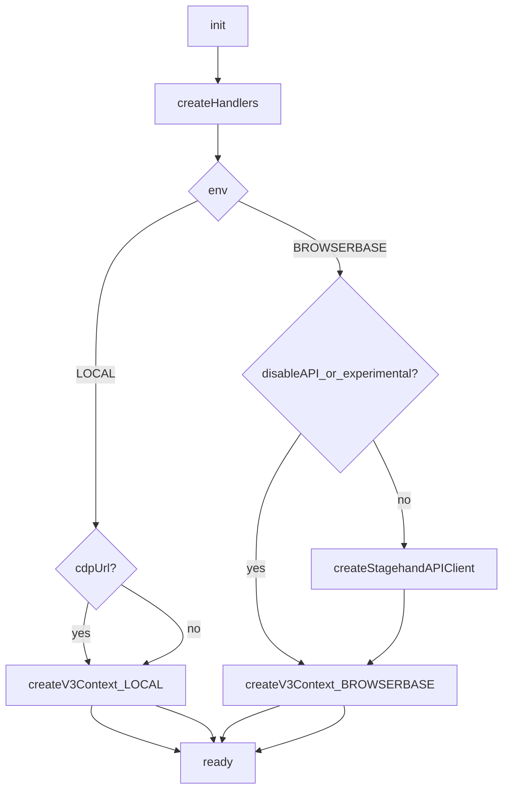

### Core 实现类清单（带定位）

> 本页聚焦“谁创建谁、谁依赖谁、依赖如何注入”。完整调用链见后续 flow 文档。

### 1) 顶层编排

- **`V3`**：`lib/v3/v3.ts`
  - **创建者**：用户代码（`new Stagehand({ ... })` / `new V3({ ... })`）
  - **持有**：`LLMProvider`、默认 `LLMClient`、`ActHandler/ExtractHandler/ObserveHandler`、`V3Context`、`ActCache/AgentCache/CacheStorage`、可选 `StagehandAPIClient`
  - **依赖注入点**：
    - `resolveLlmClient(modelOverride)`（内部方法，注入到 handlers/cache）
    - `getActHandler/getContext/getDefaultLlmClient/...`（注入到 cache）

### 2) LLM 子系统

- **`LLMClient`（抽象）**：`lib/v3/llm/LLMClient.ts`
  - 对齐 AI SDK 的 `generateText/streamText/generateObject/...`，并提供 `getLanguageModel?()`（AISDK agent 依赖）
- **`LLMProvider`（工厂）**：`lib/v3/llm/LLMProvider.ts`
  - 输入：`modelName` + `clientOptions`
  - 输出：具体 `LLMClient`（OpenAI/Anthropic/Google/Groq/Cerebras 或 AISDK 子 provider）

### 3) Handlers（act / extract / observe）

- **`ActHandler`**：`lib/v3/handlers/actHandler.ts`
  - 依赖：`LLMClient`、`captureHybridSnapshot`、`performUnderstudyMethod`、`timeoutGuard`、metrics 回调
- **`ExtractHandler`**：`lib/v3/handlers/extractHandler.ts`
  - 依赖：`LLMClient`、`captureHybridSnapshot`、schema transform/injectUrls、`timeoutGuard`
- **`ObserveHandler`**：`lib/v3/handlers/observeHandler.ts`
  - 依赖：`LLMClient`、`captureHybridSnapshot`、xpathMap 映射、`timeoutGuard`

### 4) Agent 子系统（AISDK tools / CUA）

- **AISDK tools agent**
  - **`V3AgentHandler`**：`lib/v3/handlers/v3AgentHandler.ts`
    - 依赖：`V3`、`LLMClient.getLanguageModel()`、`createAgentTools()`、可选 MCP tools
  - **`createAgentTools`**：`lib/v3/agent/tools/index.ts`
    - 产出 `ToolSet`（act/goto/extract/...），并根据 mode（dom/hybrid）裁剪
  - **MCP tools 合并**：`lib/v3/mcp/utils.ts`（`resolveTools()`）

- **CUA agent**
  - **`V3CuaAgentHandler`**：`lib/v3/handlers/v3CuaAgentHandler.ts`
    - 依赖：`V3`（截图、执行坐标动作）、`AgentProvider`（创建不同厂商的 CUA client）
  - **`AgentProvider`**：`lib/v3/agent/AgentProvider.ts`
    - 根据 modelName 或 `clientOptions.provider` 选择 `OpenAICUAClient/AnthropicCUAClient/GoogleCUAClient/MicrosoftCUAClient`

### 5) Understudy（CDP 驱动层）

- **`V3Context`**：`lib/v3/understudy/context.ts`
  - 依赖：`CdpConnection`（root ws）、`Page`（每个 top-level target 一页）、OOPIF adopt 逻辑
- **`Page`**：`lib/v3/understudy/page.ts`
  - 依赖：top-level session + adopted sessions、`FrameRegistry`、`Frame`、`Locator`、Network/Lifecycle trackers
- **`Frame`**：`lib/v3/understudy/frame.ts`
  - 依赖：**拥有该 frameId 的 CDP session**（关键约束：Page 负责保证 session ownership）
- **`Locator`**：`lib/v3/understudy/locator.ts`
  - 依赖：`Frame`、selectorResolver、注入的 locator scripts（`lib/v3/dom/build/locatorScripts.generated`）

### 6) Cache

- **`CacheStorage`**：`lib/v3/cache/CacheStorage.ts`
  - 管理 cacheDir 的创建/读写；`enabled` 由 cacheDir 是否存在决定
- **`ActCache`**：`lib/v3/cache/ActCache.ts`
  - 依赖注入：`getActHandler()`（用于回放时调用 `takeDeterministicAction`）
- **`AgentCache`**：`lib/v3/cache/AgentCache.ts`
  - 依赖注入：`getContext()`、`getActHandler()`、`act()`；支持 execute 与 stream 的 cache hit 行为一致

### 7) API 模式

- **`StagehandAPIClient`**：`lib/v3/api.ts`
  - 负责把 `act/extract/observe/agentExecute` 走 SSE streaming API
  - 关键点：会 strip 掉 SDK 侧不可序列化字段（例如 `options.page`），并把 Zod schema 转成 JSON schema

### 依赖对象图（Mermaid）

### 生命周期与创建顺序（从 `V3` 视角）

- **`new V3(opts)`**
  - 建立实例级日志上下文（`bindInstanceLogger`）
  - 解析 model（`resolveModelConfiguration`）
  - 创建 `LLMProvider` 并拿到默认 `llmClient`（或使用用户注入的 `opts.llmClient`）
  - 创建缓存基础设施：`CacheStorage.create(opts.cacheDir)` → `new ActCache(...)` → `new AgentCache(...)`
  - 初始化 `SessionFileLogger`（用于 Step/Action/CDP/LLM 流日志）

- **`await v3.init()`**（核心对象在此时才可用）
  - `new ActHandler(...)` / `new ExtractHandler(...)` / `new ObserveHandler(...)`
  - 建立 `V3Context`
    - LOCAL：attach (`cdpUrl`) 或 `launchLocalChrome()` 后 `V3Context.create(ws)`
    - BROWSERBASE：`createBrowserbaseSession()` 后 `V3Context.create(ws, { apiClient })`
  - **可选**：Browserbase 且 `!disableAPI && !experimental` 时创建 `StagehandAPIClient` 并尝试 `apiClient.init(...)`

- **运行期对象**（按需创建/短生命周期）
  - `v3.agent(...)`：每次调用会创建一个新的 handler
    - AISDK tools：`new V3AgentHandler(...)`
    - CUA：`new V3CuaAgentHandler(...)`（内部再 `new AgentProvider(...).getClient(...)`）

- **`await v3.close()`**
  - 结束 `StagehandAPIClient` session（若存在）
  - 关闭 `V3Context`（CDP connection）
  - LOCAL：杀掉 Chrome +（可选）清理临时 profile
  - 解绑 instance logger，清空事件监听，重置状态

### 依赖注入点速查（表）

| 注入点 | 注入方 | 被注入方 | 用途 |
|---|---|---|---|
| `resolveLlmClient(modelOverride)` | `V3` | `ActHandler/ExtractHandler/ObserveHandler` | 每次调用可 override model（并缓存 override client） |
| `getActHandler()` | `V3` | `ActCache/AgentCache` | cache replay 需要直接调用 `takeDeterministicAction()` |
| `getContext()` | `V3` | `AgentCache` | agent replay 需要拿到 active page 并执行 goto/scroll/... |
| `act()` | `V3` | `AgentCache` | agent replay 中 fallback 到执行 `act(instruction)` |
| `LLMClient.getLanguageModel()` | `LLMClient` 实现 | `V3AgentHandler` | AISDK agent 需要 LanguageModelV2 |

### `V3.init()` 的关键分支（Mermaid）

