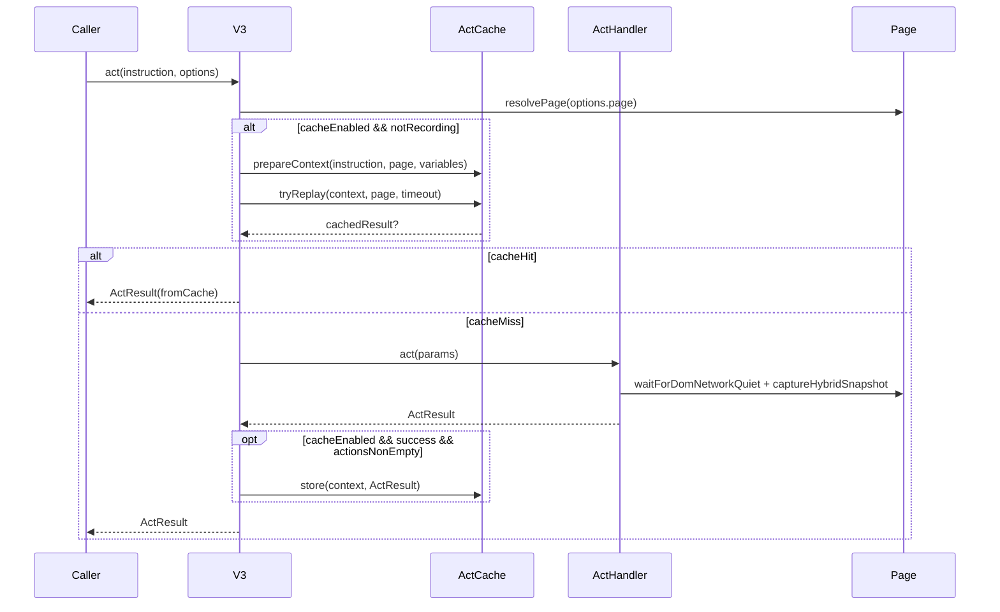
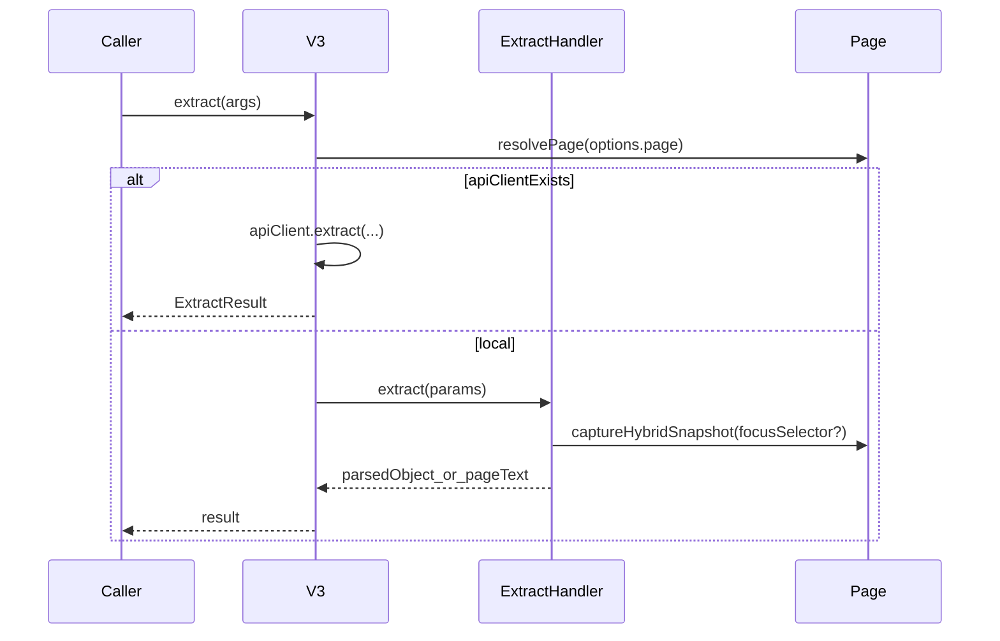
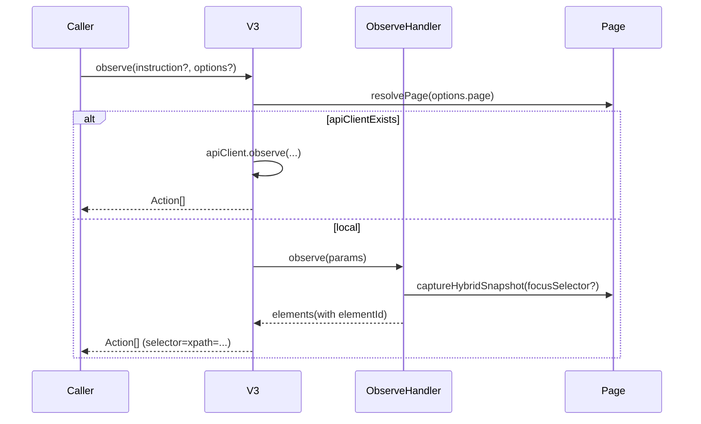

### act / extract / observe：主链路与分支

本页以 `V3` 的对外方法为入口，说明每条链路在 **本地执行** 与 **API 模式** 下的关键分支，以及它们依赖的核心数据结构。

### 总览（共同形态）

- 入口：`V3.act()` / `V3.extract()` / `V3.observe()`（`lib/v3/v3.ts`）
- 共同步骤（本地执行时）：
  - `resolvePage(options?.page)`：把 Playwright/Puppeteer page 归一化成 v3 内部 `understudy/Page`
  - 构建 a11y/hybrid snapshot（`captureHybridSnapshot`）
  - 调用 LLM 推理（`inference/*`）
  - 通过 Understudy 执行动作或返回结构化结果
  - 记录 metrics（token/time）并写入 history

- API 模式分支：若 `this.apiClient` 存在，则调用 `StagehandAPIClient.act/extract/observe(...)`，并通过 SSE 获取结果。

---

### 1) `act(instruction | Action, options?)`

#### 1.1 入口分支：ObserveResult（Action） vs instruction string

- **如果输入是 ObserveResult/Action（包含 selector）**
  - 走 `ActHandler.takeDeterministicAction(...)`（或 API 模式）
  - 目标：用已有 selector + method/args 执行确定性动作

- **如果输入是 instruction string**
  - 可能走 cache：`ActCache.prepareContext()` → `ActCache.tryReplay()`
  - cache miss 后：`ActHandler.act({ instruction, page, variables, timeout, model })`（或 API 模式）
  - 成功后：`ActCache.store()`（仅在可用且 actions 非空时）

#### 1.2 本地执行调用链（简化）

#### 1.3 `ActHandler.act()` 的关键点

- snapshot：`captureHybridSnapshot(page, { experimental: true })` → `combinedTree` + `combinedXpathMap`
- LLM 推理：`actInference(...)` 返回 `{ elementId, description, method, arguments, twoStep? }`
- selector 构造：通过 `combinedXpathMap[elementId]` → `trimTrailingTextNode` → `xpath=...`
- 执行动作：`performUnderstudyMethod(page, page.mainFrame(), method, selector, args, settleTimeout)`
- self-heal：动作失败且 `selfHeal=true` 时，会重新 snapshot + inference 生成新 selector 再试一次；成功后可更新 cache entry

---

### 2) `extract()` / `extract(instruction, schema?, options?)`

#### 2.1 入口形态

- **无参数**：`extract()` → 返回 `pageTextSchema`（实际是 `{ pageText: combinedTree }`）
- **有 instruction**：
  - 若未给 schema：默认 `defaultExtractSchema`
  - 若给 schema：支持 Stagehand 的 zod compat（`StagehandZodSchema`）

#### 2.2 本地执行调用链（简化）

#### 2.3 `ExtractHandler.extract()` 的关键点

- snapshot：`captureHybridSnapshot(page, { experimental, focusSelector })` → `combinedTree` + `combinedUrlMap?`
- schema 处理：
  - 非 object schema 会用 `{ value: schema }` 包一层，保证 inference 走 object
  - 会把 `z.string().url()` 变换为 number id（`transformSchema`），推理后再用 `injectUrls(...)` 把 URL 填回
- metrics：从 inference 响应里取 `prompt_tokens/completion_tokens/reasoning_tokens/cached_input_tokens/inference_time_ms` 上报

---

### 3) `observe(instruction?, options?)`

#### 3.1 默认 instruction

当未提供 instruction 时，`ObserveHandler` 内置一个“尽量全面找可交互元素”的默认指令。

#### 3.2 本地执行调用链（简化）

#### 3.3 `ObserveHandler.observe()` 的关键点

- snapshot：`captureHybridSnapshot` → `combinedTree` + `combinedXpathMap`
- LLM 推理：`runObserve(...)` 返回 elements（包含 elementId 等）
- selector 映射：`combinedXpathMap[elementId]` → `trimTrailingTextNode` → `xpath=...`
- shadow-root fallback：如果 elementId 不可映射，会返回一个 `not-supported` 的占位 Action

---

### 4) API 模式与 wire-format（`StagehandAPIClient`）

- **strip page**：SDK 的 `options.page` 不可序列化，会在 client 侧移除
- **schema 转换**：extract 的 `StagehandZodSchema` 会转换为 JSON schema
- **SSE**：`execute()` 读取 `data: {type: system|log, ...}` 的事件流，直到 `status=finished` 返回结果
