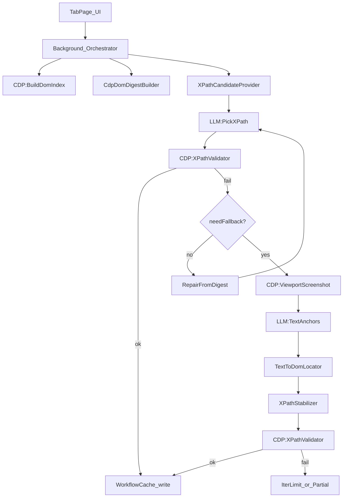

## 01 总体架构（插件 + CDP + LLM + 验证自愈）

本方案把“简历区域 XPath 生成”视为一个 **可回放工作流**：
首次用 LLM/截图/DOM 摘要跑通，随后尽可能 cache hit 直接回放；当回放失败时触发自愈更新（对齐 Stagehand v3 的 `ActCache/AgentCache` 心智模型，见 `../v3-cache.md`）。

### 关键前提（从现有实现可复用）
- **CDP DOM 索引**：`mimorepo/apps/plasmo-app/src/background/stagehandSnapshot.ts`
  - 提供 `backendNodeId -> abs XPath` 映射，并处理 `iframe.contentDocument` 缺失、CBOR stack、深度降级等问题。
- **跨 iframe/OOPIF XPath 扫描**：`mimorepo/apps/plasmo-app/src/background/libs/StagehandXPathScanner.ts`
  - 通过 `Target.setAutoAttach(flatten)` 收集子 session，并用 `mergeFrameXPath/relativizeXPath` 拼接 iframe 前缀与相对路径。
- **viewport 截图**：`mimorepo/apps/plasmo-app/src/background/libs/StagehandViewportScreenshotter.ts`
  - `Page.captureScreenshot({ fromSurface:true, captureBeyondViewport:false })`。
- **XPath 验证**：`mimorepo/apps/plasmo-app/src/background/libs/ResumeXpathValidator.ts`
  - `Runtime.evaluate(document.evaluate(...))` 批量输出 `matchedCount/firstTextSnippet`。
- **LLM 解析与反馈落盘（Nitro）**：
  - prompt：`mimorepo/apps/nitro-app/server/lib/prompts/jsonresume_xpath.ts`
  - parse：`mimorepo/apps/nitro-app/server/routes/api/resume/parse.post.ts`
  - feedback：`mimorepo/apps/nitro-app/server/routes/api/resume/feedback.post.ts`

### 明确不依赖
- **不依赖** `ResumeBlocksExtractor` 的硬编码关键词切块作为核心输入。
  - 用 `CdpDomDigestBuilder` 生成“可控体积 DOM/HTML 摘要”（见 `03-dom-digest-spec.md`）。

---

## 架构分层

### 1) 插件端（Plasmo / MV3）
- **TabPage / UI**：负责触发任务、展示中间产物、导出样本（可选）。
- **Background Service Worker**：任务编排与 CDP 执行（attach、DOM 索引、截图、验证、缓存、上报）。
- **（可选）Content Script**：在 CDP attach 不可用/受限时作为降级路径（注意：跨域 iframe/OOPIF 能力会弱化）。

### 2) LLM 端（Nitro / 任意 provider）
- **PickXPath**：在强约束（只能用 candidates 的 xpath）下输出字段 XPath。
  - 成功后必须经 CDP 验证才算完成。
- **TextAnchors**：从截图输出字段锚点/短文本片段（不直接输出 xpath），用于端上二次定位与修复。

### 3) 验证与自愈
- **验证**：强制客观判定（`matchedCount`）。
- **自愈**：失败时修复 candidates/digest/锚点/稳定化策略，并把修复后的 steps 写回 cache（对齐 v3-cache 的“回放失败→更新 cache entry”理念）。

---

## 端到端数据流（从一次任务到稳定回放）

---

## “可回放工作流”的 cache 形状（概念）

对齐 `../v3-cache.md` 的精神：cache 不是单纯存结果，而是存“**可解释的成功路径**”与“**可自愈的差异**”。

- **cacheKey 建议维度**：
  - `host`（强约束，跨站点不要复用）
  - 页面签名（见 `06-metrics-and-quality.md`：PageSignature）
  - `taskSchemaVersion`、`digestVersion`、`promptVersion`、`modelId`
- **cacheValue 建议包含**：
  - 最终 xpath map
  - 验证统计（字段级）
  - 自愈迭代日志（失败→修复→成功）

