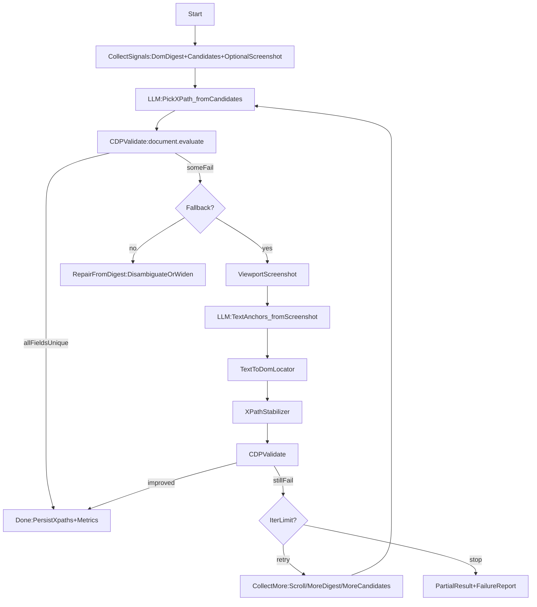

## 04 Hybrid 工作流：PickXPath 优先 + 截图/文本定位 fallback + 验证自愈

本工作流目标：在首次处理页面时，通过 LLM 与 CDP 能力快速找到“简历区域/字段”的稳定 XPath；在页面结构变化或初次误差时，通过验证与自愈循环提升成功率，并在后续任务中尽量做到 **cache hit → 无需再次 LLM 推理**（对齐 Stagehand v3 `ActCache/AgentCache` 心智模型）。

> 关键原则：**所有输出都必须可验证**。不能验证的推理，只能作为“下一步采集/定位”的建议。

---

## 总体流程（Mermaid）

---

## Step-by-step（含输入/输出）

### Step 0：准备与缓存（WorkflowCache）
- **输入**：`page.url/host`、任务 schema 版本、prompt/digest 版本、模型版本
- **动作**：
  - 生成 cacheKey（建议包含：host + 页面签名 + schema/prompt 版本）
  - 如果 cache hit：直接进入 **验证**（避免盲信缓存）
- **输出**：\n
  - hit：候选 XPath 集合（上次成功产物）\n
  - miss：进入 Step 1\n

### Step 1：采集最小必要信号（CollectSignals）
必须采集：
- **DOM digest**：见 `03-dom-digest-spec.md`
- **candidates（可选择 XPath 集合）**：\n
  - 可交互 XPath（来自 `StagehandXPathScanner`）\n
  - 文本/标题节点 XPath（由 digest 生成/派生）\n

可选采集（成本更高/按需）：
- viewport screenshot（来自 `StagehandViewportScreenshotter`）\n

输出：
- `Digest`\n
- `Candidates[]`\n
- `Screenshot?`\n

### Step 2：LLM 选择 XPath（PickXPath）
目标：让模型输出“字段 → XPath”，并且 **XPath 必须从 candidates 中选择**。

- **输入**：
  - `taskSchema`：字段列表（例如 JSON Resume 的 basics/work/education/...）
  - `candidates[]`：允许选择的 xpath 列表（含 `textSnippet/tag/layout/frameId` 等）
  - `digest`：用于 disambiguation（例如多个“姓名”节点时，结合层级/邻近）
- **LLM 约束**：
  - 只能输出严格 JSON（不带 markdown codefence）
  - 每个字段 value 是 xpath 字符串；数组字段 value 是对象数组（对象内 value 为 xpath）
  - 只能使用 candidates 里出现过的 xpath；否则判无效
- **输出**：
  - `jsonResumeXPath`（或业务 schema 的 xpath map）

### Step 3：CDP 验证（XPathValidator）
目标：把 LLM 输出变成“可客观判定的成功/失败”。

- **输入**：`xpaths[]`（从 jsonResumeXPath flatten 出来）
- **动作**：`Runtime.evaluate` 执行 `document.evaluate(xp, document, ...)`（对齐现有 `ResumeXpathValidator`）
- **输出**：每条 xpath 的
  - `matchedCount`
  - `firstTextSnippet`（用于 debug 与自愈引导）
- **通过标准**（建议）：
  - **强通过**：`matchedCount == 1`
  - **弱通过**：容器级字段允许 `matchedCount >= 1`（仅当字段类型定义为 container）
  - **失败**：`matchedCount == 0` 或 `matchedCount > 1` 或执行异常

### Step 4：失败分流（是否进入 fallback）
当存在失败字段时，按优先级选择修复路径：

1) **快速修复（无需截图）**：\n
   - 多命中：优先尝试 `RepairFromDigest`（缩小范围、改选更短文本节点、加邻近约束后重新 PickXPath）\n
   - 0 命中：先检查是否候选集覆盖不足（扩大 candidates/digest 的采样范围）\n
2) **fallback（需要截图）**：\n
   - 页面强视觉驱动/被遮挡/closed shadow/canvas\n
   - digest 无法解释“哪个区域是简历”或字段缺失明显\n

### Step 5：LLM 生成 TextAnchors（从截图/语义到文本锚点）
目标：让模型输出 **短文本锚点/字段值片段**，而不是直接编造 xpath。

- **输入**：viewport screenshot（可选再附 digest 的精简版）
- **输出**：结构化 JSON，字段 value 为：
  - `anchorText`：短文本（例如“张三”“工作经历”“本科”“深圳”）
  - `anchorType`：name/email/sectionHeading/dateRange/...（可选）
  - `confidence`：0~1（可选）
  - `notes`：不确定时说明（可选）

### Step 6：TextToDomLocator（从锚点文本回到 DOM）
目标：把 `anchorText` 映射为 **元素集合**，并尽量收敛到 1 个元素。

- **输入**：`anchorText` + `digest`（包含 normText/xpath/layout/rel）
- **匹配策略（建议顺序）**：
  - exact match（norm）
  - contains match（norm）
  - fuzzy match（编辑距离/分词）
- **歧义消解**：
  - 先限制范围：mainContainer 推断范围（由 digest 中高文本密度容器得出）
  - 再按邻近：heading 附近、同一 section 下
  - 再按 layout：距离/相对位置（需要 bbox）
- **输出**：每字段若干 `candidateElements[]`（带 xpath + score）

### Step 7：XPathStabilizer（把元素变成稳定 XPath）
目标：从候选元素生成多条 xpath，并用验证与评分选出最稳的那条。

- **输入**：`candidateElements[]`（可能跨 iframe）
- **生成策略**：
  - `absXPath`（来自 CDP 索引）
  - `iframePrefixedXPath`（对齐 `mergeFrameXPath`）
  - `relativeToContainerXPath`（相对 mainContainer 的局部路径，减少脆弱性）
- **评分建议**：
  - `matchedCount==1` 加高分（必须项）
  - 文本一致性（evaluate 到的 textSnippet 与 anchorText 接近）加分
  - 路径长度/深度惩罚（越长越脆弱）
- **输出**：修复后的 `jsonResumeXPath`（或字段 map）

### Step 8：迭代与终止
- **最大迭代次数**：建议 2~4 次（避免无限循环）
- **每轮可增加采集**：
  - 扩大 candidates 覆盖（更多 text-bearing 节点）
  - 二次截图（滚动到疑似简历区域后再截图）
  - 增加 digest 上限（节点数/深度）
- **终止输出**：
  - 成功：写入 cache + 输出最终 xpath map
  - 失败：输出 partial result + failure report（失败字段、原因、建议下一步）

---

## 决策表（简化版）

| 失败类型 | 首选动作 | 何时升级到截图 fallback |
|---|---|---|
| `matchedCount==0` | 扩大 candidates/digest 覆盖；重跑 PickXPath | 页面视觉强/字段缺失多/疑似遮挡 |
| `matchedCount>1` | 用 digest 的层级+layout 做 disambiguation；或改用更细粒度节点候选 | digest 无 bbox 或无法收敛 |
| `Runtime.evaluate` 异常 | 处理 attach/权限/页面不可注入；重试 | 无（先修系统性错误） |
| DevTools 已 attach | 让用户关闭 DevTools 或改用 content-script DOM 路径 | 必要时退化到非 CDP 模式 |
