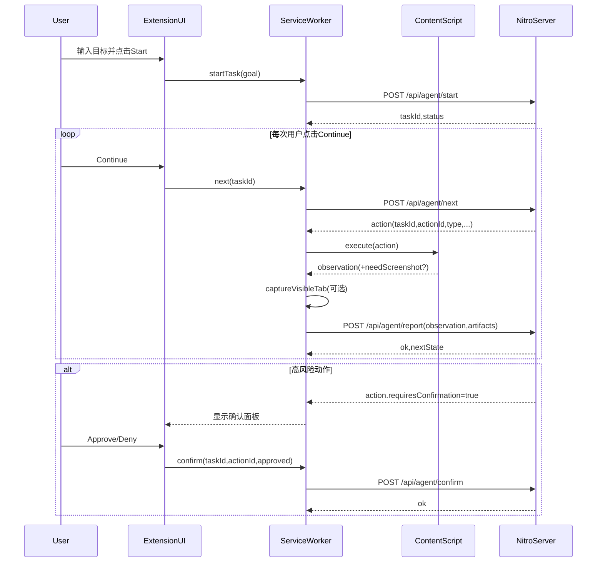

## 02 通信模型（轮询 vs Offscreen）与时序

### 结论（MVP 推荐）
- **轮询/短请求 + 用户点击推进** 是最稳的 MVP。
- Offscreen Document 适合产品化阶段追求实时性时再评估。

---

### 1) 轮询 vs Offscreen 对比

| 维度 | 轮询/短请求（MVP 推荐） | Offscreen Document（进阶） |
|---|---|---|
| 实现复杂度 | 低：纯 `fetch` + `chrome.alarms`/UI触发 | 高：管理 offscreen 生命周期/消息转发 |
| 可靠性 | 高：SW 被回收也能继续 | 中：更常驻但仍需异常处理 |
| 实时性 | 一般（取决于间隔） | 更好（可承载长连接） |
| 资源消耗 | 可控 | 相对更高 |
| 调试成本 | 低 | 中-高 |

---

### 2) 推荐的 MVP 通信协议（关键：避免重复执行）

#### 2.1 幂等与去重
- 后端下发 Action 必须带：`taskId`、`actionId`。
- 插件 report 必须带：`taskId`、`actionId`。
- 后端必须：
  - 对重复 report 做去重。
  - 对重复 next 拉取不生成语义重复的新 action（除非显式重试）。

#### 2.2 执行锁（避免并发）
- 同一 `taskId` 同时只允许一个 action 处于执行中。
- 插件侧也要维护“消费锁”（例如正在执行时禁止再次触发 next）。

---

### 3) 时序图（MVP：用户点击推进）

---

### 4) 何时需要 Offscreen Document
- 需要更强实时性（例如自动等待页面事件、长时间后台运行）。
- 需要更稳定的长连接承载（但仍要处理异常与权限）。

建议策略：
- 先用轮询跑通“协议 + 风控 + 审计”。
- 再把通信层替换为 offscreen（不改变上层协议）。
