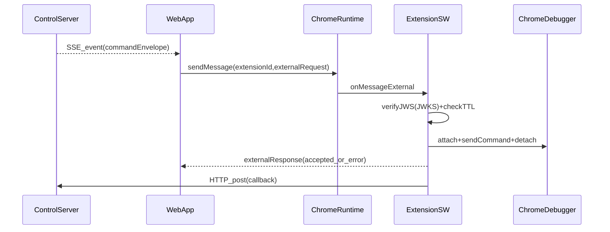

# 控制端→WebApp→扩展：通信契约（tmind 参考版）

> 目标：把“控制端服务 → WebApp（前端页）→ MV3 扩展（chrome.debugger/CDP）”跑通；扩展侧执行结果与遥测通过 **HTTP** 回传控制端服务。

## 0. 决策记录（已敲定）

- **下发**：ControlServer → WebApp 使用 **SSE**
- **WebApp 形态**：仅做中转/可视化，不承载 Stagehand（Stagehand 在服务器）
- **外部网页→扩展**：`externally_connectable` + `chrome.runtime.onMessageExternal`（参考 `tmind`）
- **命令防伪**：服务端对命令做 **JWS**，扩展用 **JWKS** 验签（无需人工确认）
- **扩展→服务端回传**：直接 **HTTP POST**
- **不做**：Native Messaging、下载行为控制（`Browser.setDownloadBehavior`）
- **extensionId**：固定不变（企业分发，必要时可在构建产物 manifest 注入 `key` 固定 ID）

## 1. tmind 可复用点（用于补全本方案）

- 扩展外部入口（窄协议 + 可序列化错误）：  
  `/Users/sodaabe/codes/coding/mimo/.sources/tmind/apps/browser-operator/background/messages/external.ts`
- Web 侧 sendMessage 封装（处理 `runtime.lastError` + 本地缓存 extensionId 的思路）：  
  `/Users/sodaabe/codes/coding/mimo/.sources/tmind/apps/next-app/app/control/lib/extension-tab-manager-client.ts`
- manifest 外部可连通配置示例：  
  `/Users/sodaabe/codes/coding/mimo/.sources/tmind/apps/browser-operator/build/chrome-mv3-prod/manifest.json`

## 2. 总体时序（闭环）



---

## 3. 契约 A：ControlServer → WebApp（SSE Command Stream）

### 3.1 Endpoint

- `GET /control/stream`

### 3.2 SSE Event

- event: `command`
- data: JSON（`ControlCommandEnvelope`）

### 3.3 Schema：`ControlCommandEnvelope`

```json
{
  "type": "control.command",
  "commandId": "cmd_...",
  "traceId": "tr_...",
  "issuedAt": 1730000000000,
  "ttlMs": 30000,
  "target": {
    "extensionId": "fixed_extension_id",
    "tabId": 123
  },
  "jws": "eyJ...<compact JWS>..."
}
```

### 3.4 语义要求

- **幂等**：`commandId` 必须全局唯一
- **重连**：WebApp 断线需自动重连（EventSource 默认行为）；建议后续补 `Last-Event-ID`（可选）
- **过期**：超过 `issuedAt + ttlMs`，WebApp 可仍转发（便于扩展回“过期”错误），但服务端不得再推进状态机

---

## 4. 契约 B：WebApp → Extension（External Messaging RPC）

### 4.1 manifest 约束（扩展）

- `externally_connectable.matches` 必须包含 WebApp 的 origin（tmind dev 用 `http://localhost/*`）
- 需要的权限（最小）：`debugger`（视需求可能还要 `tabs`、`scripting` 等）

### 4.2 Request：`ExternalRequest`

```json
{
  "type": "driver",
  "action": "invoke",
  "requestId": "web-1730000000000",
  "commandId": "cmd_...",
  "traceId": "tr_...",
  "target": { "tabId": 123 },
  "jws": "eyJ...<compact JWS>..."
}
```

### 4.3 Response：`ExternalResponse`

成功：

```json
{
  "ok": true,
  "requestId": "web-1730000000000",
  "commandId": "cmd_...",
  "traceId": "tr_...",
  "data": { "accepted": true }
}
```

失败：

```json
{
  "ok": false,
  "requestId": "web-1730000000000",
  "commandId": "cmd_...",
  "traceId": "tr_...",
  "error": { "message": "Invalid signature", "name": "AuthError" }
}
```

### 4.4 扩展侧必须执行的校验

- **窄入口**：仅处理 `type:"driver"`，否则忽略
- **sender 二次校验**：基于 `sender.url` 做 allowlist（manifest 是第一道门）
- **验签**：按 `kid` 拉取/缓存 JWKS，校验 JWS
- **时效**：检查 `issuedAt + ttlMs`；允许 clockSkew（待实现时给默认 60s）
- **错误结构稳定**：只返回 `{message,name?}`（tmind 的 `toErrorPayload`）

---

## 5. 契约 C：Extension → ControlServer（HTTP 回传）

### 5.1 Endpoint

- `POST /control/callback`

### 5.2 Headers

- `Authorization: Bearer <callbackToken>`
- `Content-Type: application/json`

### 5.3 Body：`ExecutionCallback`

```json
{
  "type": "control.callback",
  "commandId": "cmd_...",
  "traceId": "tr_...",
  "at": 1730000001000,
  "status": "ok",
  "result": {
    "kind": "cdp.send",
    "tabId": 123,
    "method": "Runtime.evaluate",
    "response": { "result": { "type": "number", "value": 2 } }
  },
  "telemetry": { "durationMs": 120, "attempt": 1 }
}
```

错误回传：

```json
{
  "type": "control.callback",
  "commandId": "cmd_...",
  "traceId": "tr_...",
  "at": 1730000001000,
  "status": "error",
  "error": { "message": "No such tab", "name": "TargetError" },
  "telemetry": { "durationMs": 12, "attempt": 1 }
}
```

### 5.4 服务端处理语义

- **幂等去重**：按 `commandId` 去重；重复 callback 只更新 telemetry/审计，不推进两次
- **超时**：超出 `ttlMs` 的 callback 可入库，但不得推进 Stagehand 状态机

---

## 6. JWS/JWKS 约定（扩展验签的真实载荷）

> 原则：所有会影响执行的字段必须位于签名体中（避免中转层/网页篡改）。

### 6.1 Signed Payload：`SignedCommand`

```json
{
  "iss": "control-server",
  "aud": "browser-extension",
  "commandId": "cmd_...",
  "traceId": "tr_...",
  "issuedAt": 1730000000000,
  "ttlMs": 30000,
  "target": { "tabId": 123 },
  "op": { "kind": "cdp.send", "method": "Runtime.evaluate", "params": { "expression": "1+1" } },
  "reply": { "url": "https://control.example.com/control/callback", "callbackToken": "ct_..." }
}
```

### 6.2 JWKS

- `GET /.well-known/jwks.json`
- 扩展缓存 JWKS；`kid` 未命中或验签失败时可触发一次刷新再验（防止轮换瞬断）

---

## 7. 最小验收用例（Smoke）

1. WebApp 连上 SSE，能收到 `command` 事件
2. WebApp 通过 `sendMessage` 把 commandEnvelope 转发给扩展，能收到 `accepted` 或稳定错误
3. 篡改 `method/params` 必须被扩展拒绝（验签生效）
4. 扩展用 `chrome.debugger` 执行最小 CDP 命令并回传 HTTP callback
5. 服务端按 `commandId/traceId` 关联回调并推进下一步（或记录错误并终止）


