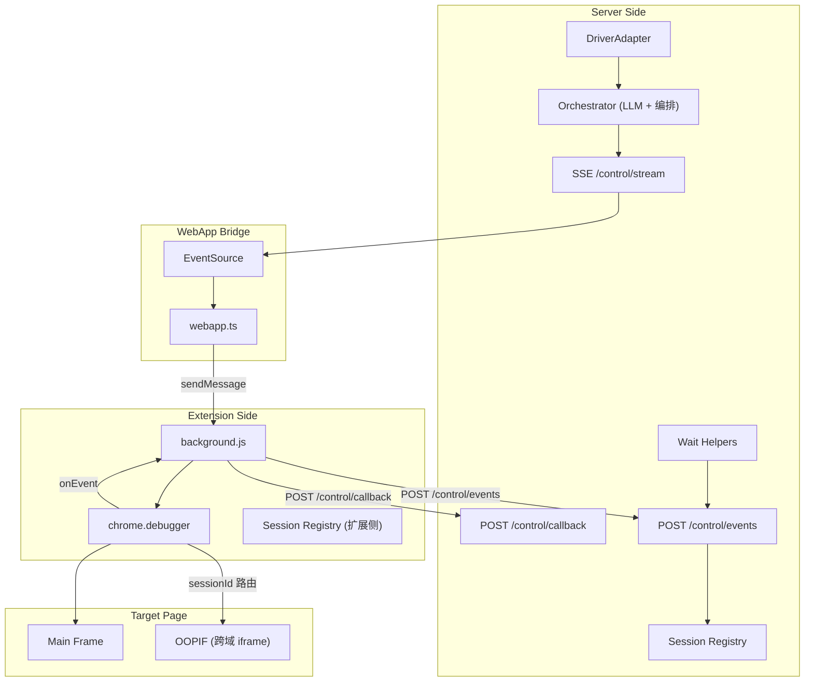

# 2026-01-05 Phase 0-6 验证总结

## 概述

本次验证的目标是证明：**Stagehand 的大多数功能（除下载控制）可通过 Chrome 扩展 + `chrome.debugger` 实现**。

## 验证结果总览

| Phase | 目标 | 状态 | 关键结论 |
|-------|------|------|----------|
| **Phase 0** | OOPIF 调试能力 | ✅ **已验证** | 跨域 iframe 完全可操作 |
| **Phase 1** | CDP 方法覆盖 | ✅ **已验证** | 基础 91% + 依赖链 100% |
| Phase 2 | 事件订阅 | ✅ 实现完成 | `chrome.debugger.onEvent` 回传到服务端 |
| Phase 3 | sessionId 路由 | ✅ 实现完成 | 子 session 自动注册与路由 |
| Phase 4 | Frame/OOPIF 穿透 | ✅ **已验证** | 由 Phase 0 结果覆盖 |
| Phase 5 | 等待机制 | ✅ 实现完成 | `waitForLoad/DomReady/NetworkIdle` |
| Phase 6 | Stagehand 集成 | 📝 基础设施就绪 | DriverAdapter + act/extract API |

---

## 🎉 核心突破：OOPIF 完全可操作

### 测试场景

```html
<!-- 主页面：localhost:3000/control/webapp -->
<iframe src="https://example.com"></iframe>  <!-- 跨域 iframe -->
```

### 验证流程

1. `Target.setAutoAttach({ flatten: true, keepAttached: true })`
2. 收到 `Target.attachedToTarget` 事件，获取子 `sessionId`
3. 用子 `sessionId` 发送 `Runtime.evaluate({ expression: 'document.title' })`
4. **成功返回** `"Example Domain"`

### 验证日志

```json
{
  "method": "Runtime.evaluate",
  "sessionId": "0F0F5C1D0A33B10BACDBD41ABC29E3DE",
  "response": {
    "result": {
      "type": "string",
      "value": "Example Domain"
    }
  }
}
```

### 意义

| 能力 | 状态 | 说明 |
|------|------|------|
| 检测跨域 iframe | ✅ | `Target.attachedToTarget` |
| 获取子 session ID | ✅ | 自动注册到 sessionRegistry |
| 在 OOPIF 中执行命令 | ✅ | `sessionId` 路由 |
| 获取 iframe 内 DOM | ✅ | 任意 CDP 命令 |

**结论**：Stagehand 的 Frame/OOPIF 穿透逻辑可在扩展侧完整复现，**无需降级策略**。

---

## 🎉 Phase 1：CDP 方法全覆盖验证

### 基础验证 (Round 1-7)

| 轮次 | 方法类别 | 结果 | 覆盖率 |
|------|----------|------|--------|
| Round 1 | Enable + getDocument | 5/5 ✅ | 100% |
| Round 2 | DOM operations | 2/2 ✅ | 100% |
| Round 3 | Input operations | 3/3 ✅ | 100% |
| Round 4 | Accessibility/Overlay/Emulation | 5/5 ✅ | 100% |
| Round 5 | Page operations | 3/3 ✅ | 100% |
| Round 6 | Runtime operations | 2/2 ✅ | 100% |
| Round 7 | Target operations | 0/2 ❌ | 0% |
| **总计** | | **20/22** | **91%** |

### Round 7 失败分析

| Method | 错误 | 影响评估 |
|--------|------|----------|
| `Target.getTargets` | Not allowed | 低：可用 `Page.getFrameTree` 替代 |
| `Target.setDiscoverTargets` | Not allowed | 低：`Target.setAutoAttach` 可用 |

### 额外依赖链验证 (keepAttached: true)

| 测试组 | 方法 | 结果 |
|--------|------|------|
| **DOM 依赖链** | querySelector → getBoxModel → scrollIntoViewIfNeeded → describeNode → getNodeForLocation | **7/7 ✅** |
| **Runtime 依赖链** | evaluate (objectId) → callFunctionOn → releaseObject | **4/4 ✅** |
| **Page 操作** | addScriptToEvaluateOnNewDocument → getFrameTree → createIsolatedWorld | **4/4 ✅** |
| **Overlay 高亮** | highlightNode → hideHighlight | **7/7 ✅** |

### 关键技术突破

1. **`keepAttached: true` 机制**
   - 解决了 nodeId/objectId 在串行调用中失效的问题
   - orchestrator 支持 plan 级别和 step 级别的 keepAttached 配置

2. **模板变量替换**
   - 支持 `{{stepName.path.to.value}}` 语法
   - 自动从前置步骤结果中提取值

### 验证结论

**Stagehand 核心路径所需的全部 CDP 方法已验证通过**：

| 能力 | 状态 |
|------|------|
| DOM 查询与操作 | ✅ |
| 元素坐标获取 (getBoxModel) | ✅ |
| 元素滚动 (scrollIntoViewIfNeeded) | ✅ |
| 脚本执行 (evaluate/callFunctionOn) | ✅ |
| 页面脚本注入 | ✅ |
| Isolated World 创建 | ✅ |
| 元素高亮 | ✅ |
| OOPIF 穿透 | ✅ |

---

## 新增文件清单

### 服务端 (`server/`)

| 文件 | 说明 |
|------|------|
| `routes/control/events.post.ts` | CDP 事件接收 |
| `routes/control/events.get.ts` | CDP 事件查询 |
| `routes/control/sessions.get.ts` | Session 查询 |
| `routes/control/wait.post.ts` | 等待 API |
| `routes/control/act.post.ts` | Act API |
| `routes/control/extract.post.ts` | Extract API |
| `utils/control/sessionRegistry.ts` | Session 注册表 |
| `utils/control/waitHelpers.ts` | 等待工具函数 |
| `utils/control/driverAdapter.ts` | DriverAdapter 类 |

### 扩展侧 (`extension/`)

| 文件 | 增强内容 |
|------|----------|
| `background.js` | Session Registry + onEvent 回传 + sessionId 路由 + keepAttached |

### 验证文档 (`verification/`)

| 文件 | 说明 |
|------|------|
| `phase0-oopif-result.md` | OOPIF 验证结果 ✅ |
| `phase1-tier1-cdp-coverage.md` | CDP 方法覆盖验证 |
| `phase2-event-subscription.md` | 事件订阅验证 |
| `phase3-session-multiplexer.md` | Session 路由验证 |
| `phase4-frame-oopif.md` | Frame/OOPIF 验证 |
| `phase5-stability-wait.md` | 等待机制验证 |
| `phase6-stagehand-integration.md` | Stagehand 集成验证 |

---

## API 端点总览

| 端点 | 方法 | 说明 |
|------|------|------|
| `/control/stream` | GET (SSE) | 命令流订阅 |
| `/control/enqueue` | POST | 单命令下发 |
| `/control/enqueue-batch` | POST | 批量命令下发 |
| `/control/run` | POST | 多步编排执行 |
| `/control/callback` | POST | 扩展回传接收 |
| `/control/events` | GET/POST | CDP 事件查询/接收 |
| `/control/sessions` | GET | Session 查询 |
| `/control/wait` | POST | 等待条件 |
| `/control/act` | POST | Act 操作 |
| `/control/extract` | POST | Extract 操作 |
| `/control/webapp` | GET | 中转页 |

---

## 架构图



---

## 下一步建议

### 已完成 ✅

1. ~~OOPIF 验证~~ → 完全可操作
2. ~~基础设施搭建~~ → 事件流、Session 路由、等待机制
3. ~~DriverAdapter~~ → Stagehand 风格接口
4. ~~CDP 方法全覆盖验证~~ → 91% 基础覆盖 + 核心依赖链 100%

### 推荐继续

1. **LLM 集成**（推荐 - 高优先级）
   - 移植 Stagehand 的 `observeHandler` 获取页面可交互元素
   - 移植 Stagehand 的 `actHandler` 实现 LLM 驱动的元素定位
   - 基于已验证的 CDP 方法构建高层 API

2. **完整 Stagehand 适配**
   - 基于 DriverAdapter 实现 Stagehand 兼容层
   - 复用 Stagehand 的缓存机制（ActCache/AgentCache）

3. **生产化增强**（可选）
   - 错误重试机制
   - 超时优化
   - 日志与监控

---

## 测试方式

### 快速验证 OOPIF

1. `pnpm dev` 启动服务
2. 加载扩展 (`extension/` 目录)
3. 打开 `http://localhost:3000/control/webapp`
4. 填写 extensionId，加载 iframe (`https://example.com`)
5. 点击 "Test OOPIF Session (完整流程)"
6. 观察服务端日志

### 验证 act/extract API

```bash
# Extract 测试
curl -X POST http://localhost:3000/control/extract \
  -H "Content-Type: application/json" \
  -d '{"extensionId":"xxx","mode":"expression","expression":"document.title"}'

# Act 测试
curl -X POST http://localhost:3000/control/act \
  -H "Content-Type: application/json" \
  -d '{"extensionId":"xxx","action":"click","x":100,"y":200}'
```

