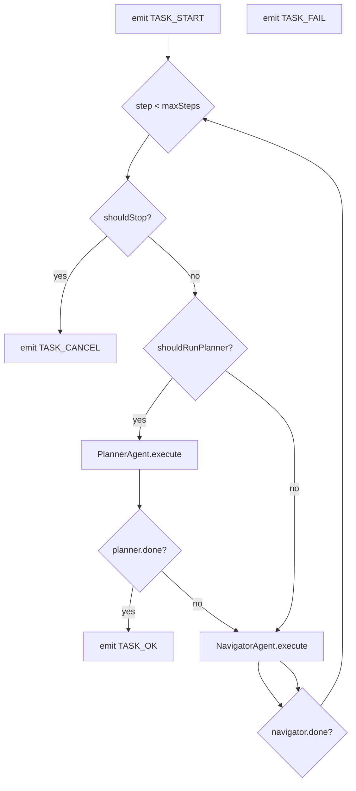

### 任务执行链路：`new_task` → `Executor.execute()`

本文描述 core_ext 下最关键的执行主链路：side-panel 发起任务、background 初始化执行器、多 agent 协作、事件回推与清理。

---

### 1) 入口：side-panel Port 消息

文件：`chrome-extension/src/background/index.ts`

- side-panel 与 background 通过 `chrome.runtime.connect({ name: 'side-panel-connection' })` 建立长连接。
- background 会校验 sender（URL + extensionId），防止非预期页面连接。

主要消息：

- `new_task`：创建 Executor 并执行
- `follow_up_task`：向同一 Executor 追加任务文本并再次执行
- `pause_task` / `resume_task` / `cancel_task`
- `replay`：加载历史并回放（走 `Executor.replayHistory`）

---

### 2) `setupExecutor()`：依赖注入与运行参数拼装

文件：`chrome-extension/src/background/index.ts`

- **读取 providers**：`llmProviderStore.getAllProviders()`
  - 如果没有 providers：抛 `bg_setup_noApiKeys`
- **读取 agentModels**：`agentModelStore.getAllAgentModels()`
  - 会先 `cleanupLegacyValidatorSettings()`
  - 要求 Navigator 必须配置（Planner 可选）
- **构建 LLM**：`createChatModel(providerConfig, modelConfig)`
  - 根据 providerId 选择 LangChain ChatModel（OpenAI/Anthropic/Gemini/Ollama/Groq/...）
  - Azure 会走单独逻辑（Endpoint + deployment + apiVersion）
- **应用 firewall**：`firewallStore.getFirewall()`
  - enabled 时写入 `browserContext.updateConfig({ allowedUrls, deniedUrls })`
- **应用 general settings**：`generalSettingsStore.getSettings()`
  - 写入 `browserContext.updateConfig({ minimumWaitPageLoadTime, displayHighlights })`
  - 注入 `Executor` 的 `agentOptions`（maxSteps/maxFailures/maxActionsPerStep/useVision/planningInterval...）

---

### 3) `Executor` 组装（构造函数阶段）

文件：`chrome-extension/src/background/agent/executor.ts`

构造时完成“对象图”组装：

- `MessageManager`：初始化消息历史（system + task + 示例 + history marker）
- `EventManager`：Execution 事件总线
- `AgentContext`：持有 AbortController、BrowserContext、MessageManager/EventManager、options、history
- `ActionBuilder`：创建默认 actions（goToUrl/click/input/scroll/...）
- `NavigatorActionRegistry`：注册 actions，并动态生成输出 schema
- `NavigatorAgent`：负责执行 actions
- `PlannerAgent`：负责周期性规划与 done 判定

---

### 4) `Executor.execute()`：多 agent 协作循环

核心逻辑（概念化）：

关键点：

- Planner 触发条件：`nSteps % planningInterval === 0` 或 `navigatorDone === true`
- Navigator 每步执行后 `context.nSteps++`
- 错误分类：Auth/Forbidden/BadRequest/URLNotAllowed/Abort/ExtensionConflict 会直接抛出；其它错误计入 `consecutiveFailures`，超过 `maxFailures` 则 fail。

---

### 5) 事件推送与自动清理

文件：`chrome-extension/src/background/index.ts`

- background 通过 `subscribeToExecutorEvents(executor)` 订阅 `EventType.EXECUTION`
- 每个 `AgentEvent` 会 `port.postMessage(event)` 推送给 side-panel
- 若 event.state 属于 `TASK_OK|TASK_FAIL|TASK_CANCEL`：自动 `await currentExecutor.cleanup()`

---

### 6) 取消/中断路径（核心）

- **side-panel 关闭**：`port.onDisconnect` → `currentExecutor?.cancel()`
- **debugger detached（canceled_by_user）**：`chrome.debugger.onDetach` → `currentExecutor?.cancel()` + `browserContext.cleanup()`
- **显式 cancel_task**：`Executor.cancel()` → `context.stop()` → 延迟 abort signal
- **tab 关闭**：`chrome.tabs.onRemoved` → `browserContext.removeAttachedPage(tabId)`（避免引用失效 tab）

---

### 7) 历史回放与持久化

- 保存：若 `generalSettings.replayHistoricalTasks === true`，executor 在 finally 中调用：
  - `chatHistoryStore.storeAgentStepHistory(taskId, originalTask, JSON.stringify(context.history))`
- 回放：background 处理 `replay` 消息：
  - `setupExecutor(...)` → `Executor.replayHistory(historySessionId)`
