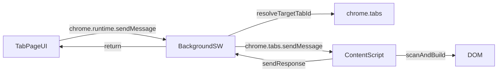

# StagehandXPath 协议说明（plasmo-app）

本文档描述 `mimorepo/apps/plasmo-app` 内 StagehandXPath 的**协议层**：Tab Page ↔ Background ↔ Content 的消息结构、字段含义、数据流与典型错误。

> 说明：协议层负责“**扫哪个 tab、扫什么元素、返回什么结果**”；具体 XPath 生成规则属于算法层（见 `@repo/sens` 文档）。

## 涉及文件

- 协议类型定义：`src/types/stagehand-xpath.ts`
- Tab Page UI：`src/tabs/stagehand-xpath.tsx`
- Background 路由：`src/background/index.ts`
- Content 执行：`src/content.ts`

## 消息常量

`STAGEHAND_XPATH_SCAN`：触发一次扫描 + 生成 XPath 的请求类型。

## 数据流



## 请求结构（payload）

定义：`StagehandXPathScanPayload`

字段：
- `targetTabId?`: number\n  - 可选；指定要扫描的 tab。\n  - 若未提供，Background 会默认选择“当前窗口的 active tab”。\n- `maxItems`: number\n  - 最大返回条数（按遍历顺序截断）。\n- `selector`: string\n  - 用于 `document.querySelectorAll` 的选择器（“可交互元素”候选集）。\n- `includeShadow`: boolean\n  - 是否遍历 open shadowRoot（只对 open shadow DOM 生效）。\n
Tab Page 会把用户输入的配置 JSON 解析成上述字段后发送给 Background。

## 响应结构

定义：`StagehandXPathScanResponse`

成功：
- `ok: true`
- `items: StagehandXPathItem[]`
- `meta?`（可选）：`totalCandidates` / `durationMs`

失败：
- `ok: false`
- `error: string`

## item 字段说明

`StagehandXPathItem`：
- `xpath`: string（stagehand 风格绝对 XPath，每段带 `[n]`）\n- `tagName`: string\n- `id?`: string\n- `className?`: string\n- `textSnippet?`: string（截断的可读文本）\n
## 目标 Tab 选择（Tab Page 下拉框）

Tab Page 会拉取 tabs 列表用于选择目标：\n- 选 “当前活动标签页”：不传 `targetTabId`，由 Background 解析 active tab。\n- 选某个具体 tab：传 `targetTabId`。\n\n同时会对不可扫描的 URL 做标记/禁用（例如 `chrome://`、`chrome-extension://`、`about:`、`devtools://`、`file://` 等）。

## 典型错误与处理

### 1) `Receiving end does not exist`

含义：Background 往目标 tab 发 `chrome.tabs.sendMessage`，但目标 tab 内**没有注入 content script**，因此不存在接收端。

常见原因：
- tab 在扩展重载之前就已打开，content script 没有重新注入\n- 目标页面属于受限 scheme（`chrome://` 等），无法注入\n
处理策略（当前实现）：
- Background 检测到该错误后，会尝试用 `chrome.scripting.executeScript` 动态注入 manifest 中声明的 content script 文件，然后**重试一次**。\n
### 2) 目标 Tab 不可扫描

Background 会在转发前用 `chrome.tabs.get(tabId)` 校验 URL，若 URL scheme 不可注入则直接返回错误。\n\n建议：使用 `http/https` 页面进行扫描。

## 示例

请求（Tab Page -> Background）：

```json
{
  "type": "STAGEHAND_XPATH_SCAN",
  "payload": {
    "targetTabId": 123,
    "maxItems": 200,
    "selector": "a,button,input,textarea,select,[role='button'],[onclick]",
    "includeShadow": false
  }
}
```

成功响应：

```json
{
  "ok": true,
  "items": [
    {
      "xpath": "/html[1]/body[1]/div[2]/a[1]",
      "tagName": "a",
      "id": "",
      "className": "btn primary",
      "textSnippet": "登录"
    }
  ],
  "meta": {
    "totalCandidates": 57,
    "durationMs": 38
  }
}
```

