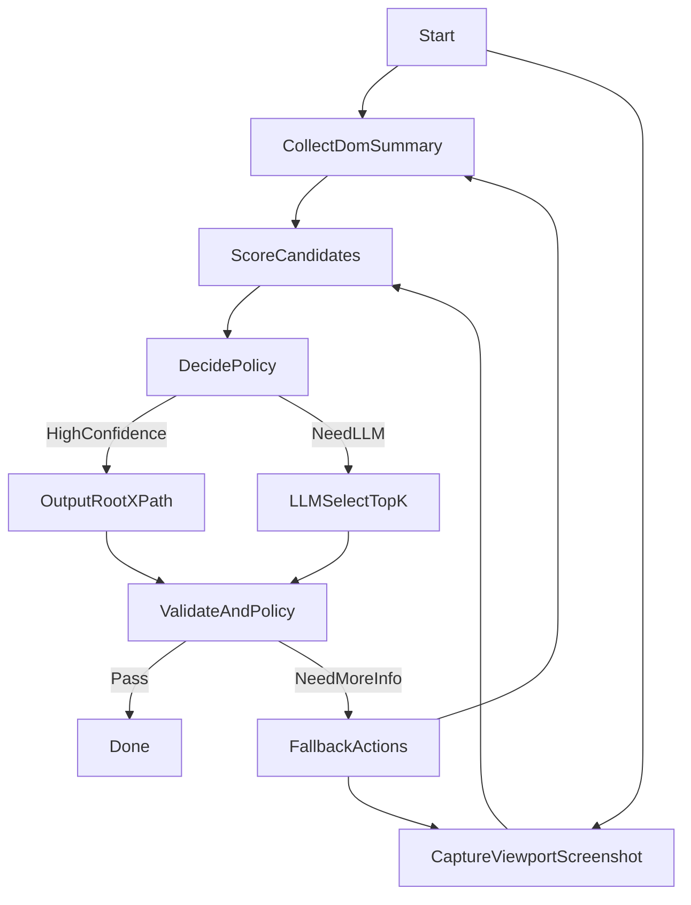

# 最终方案：服务端编排与回传协议（Stagehand 风格）

本章把 `01~05` 的结论落成“可由服务端控制调度”的 stagehand 风格编排：端侧（扩展/agent）只负责采集与执行动作，服务端负责评分、裁决、校验与回退。

能力对齐：

- 《图像与 DOM 落地原则》：默认并行采集 DOM 摘要 + viewport 截图；必要时做核验与闭环
- 《StagehandXPath 协议》：`STAGEHAND_XPATH_SCAN` 作为辅助能力（稳定 XPath 基线与 iframe 前缀语义），简历识别主路径必须补采集 anchors/candidates/stats

---

## 1. 角色划分

### 服务端（Orchestrator）

- 维护任务状态（同一份简历页的多轮采集/滚动/核验）
- 候选打分与阈值策略（coverage/linkDensity/interactiveDensity 等）
- 触发 LLM 兜底（仅在 TopK candidates 内裁决）
- 自校验与回退策略（滚动/二次采集/扩大 anchors/截图核验）
- 输出最终 `rootXpath + confidence + evidence`

### 端侧（Extension/AgentRunner）

- 执行采集指令并回传结构化结果：
  - `CollectDomSummary`：anchors + candidate summaries（含 xpath/textPreview/stats）
  - `CaptureViewportScreenshot`：viewport 截图（必要时）
  - 可选：`StagehandXPathScan`：复用现有协议获得稳定 xpath 列表
- 执行动作指令：
  - `Scroll` / `WaitFor` / `DismissOverlays`（若具备）

---

## 2. 编排状态机（推荐默认：Pipeline C 并行融合）

### DecidePolicy（规则示意）

- 若 `coverage >= 0.75` 且 `fieldTypeCount >= 3` 且 `linkDensity <= 0.20`：
  - 直接输出（同时保留截图核验结果；若截图显示遮挡，则转 Fallback）
- 若 `coverage in [0.55, 0.75)` 或 `Top2ScoreGap < 0.10` 或 `fieldTypeCount < 3`：
  - 进入 LLMSelectTopK
- 若 `coverage < 0.55`：
  - 不走 LLM，直接 Fallback（滚动/二次采集/扩大 anchors）

---

## 3. 回传协议（建议 JSON schema 形态）

> 目标：最小化 token/带宽，同时让服务端可重放、可审计、可调参。

### 3.1 服务端 → 端侧：指令

- `taskId`: string（幂等关键字）
- `step`: string（例如 `CollectDomSummary`/`CaptureViewportScreenshot`/`Scroll`）\n- `params`: object（例如滚动次数、采样预算、TopK 数量等）
- `policyVersion`: string（便于灰度与回溯）

### 3.2 端侧 → 服务端：采集回传（DOM 摘要）

建议字段：

- `taskId`
- `url/title/ts`
- `frameSummaries`: array（按 frameKey 分组）
  - `frameKey`
  - `anchors`: array（见 `02`）
  - `candidates`: array（建议先回传“候选摘要全集”，或仅回传“评分需要的候选摘要”）
- 可选：`stagehandXPathItems?`（`STAGEHAND_XPATH_SCAN` 的 items，仅作辅助/对齐）
- `meta`：采集耗时、采样预算、是否包含 shadow 等

### 3.3 端侧 → 服务端：截图回传（可选）

- `taskId`
- `image`: `base64` / `dataUrl`
- `viewport`: `{w,h,dpr?,scale?}`（尽量把像素坐标体系写清）
- 可选：`candidateBoxes`（若端侧能计算 bbox，把 TopK 候选框出来更利于 LLM/核验）

---

## 4. 端侧采集策略（与 StagehandXPath 能力协同）

### 4.1 为什么仍保留 `STAGEHAND_XPATH_SCAN`

尽管它不适合直接做简历正文识别，但它在以下场景仍有价值：

- iframe 前缀 XPath 语义对齐（尤其 OOPIF）
- 作为“可交互元素 XPath 基线”：后续若要点击/展开/翻页，可直接复用

### 4.2 简历识别的主采集（必须新增/补足）

端侧必须提供：

- anchors（基于 innerText/textContent 的字段命中，而非 aria/title 的 textSnippet）
- candidates 的 textPreview + stats（用于评分与 LLM 裁决）
- 可选 bbox/可见性（用于“只要正文”的排除与截图核验）

---

## 5. 失败处理与回退策略（服务端可控）

### 5.1 常见失败

- **内容未加载完成**：anchors 太少，coverage 低
- **弹窗遮挡**：截图显示正文被覆盖
- **推荐区干扰**：linkDensity 高、Top2 分差小
- **滚动加载**：经历区在下方，首屏 anchors 不足

### 5.2 回退动作（按优先级）

- `WaitFor`：等待网络/渲染稳定（若你们有页面加载状态监听能力，可作为 gate）
- `DismissOverlays`：尝试关闭 modal/遮罩（若具备点击能力）
- `Scroll`：滚动 N 次并再次 `CollectDomSummary`（可按“anchors 增量”决定是否继续滚动）
- `ExpandAnchors`：放宽弱锚点规则，但保持降噪
- `ReScreenshot`：二次截图核验

---

## 6. 安全与隐私（强建议写入服务端策略）

- **最小化回传文本**：只回传候选 textPreview（截断/去重/必要时脱敏），不要回传整页 HTML
- **PII 脱敏**：手机号/邮箱在回传与日志中可掩码（保留“命中类型”与少量上下文即可）
- **注入防护**：页面文本一律视为不可信；LLM 只能在 candidates 内选择，不得执行页面指令
- **审计日志**：保存 policyVersion、输入摘要、输出与 evidence，便于调参与回溯

