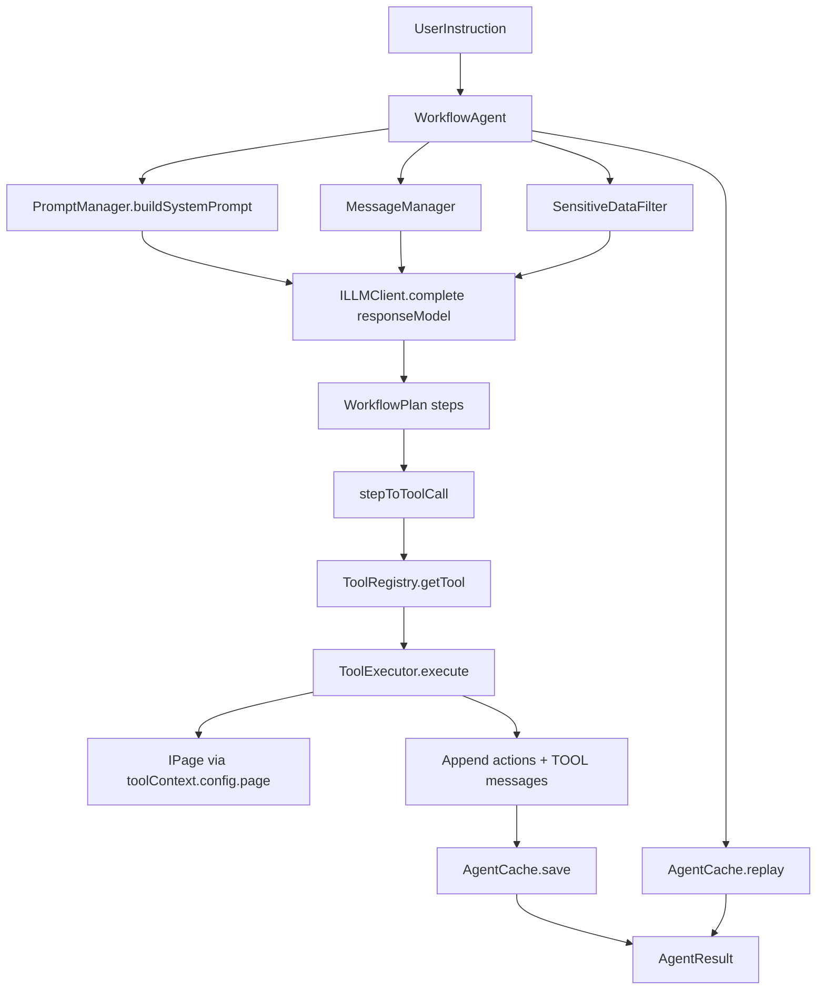

# 02-模块与数据流（Stage01-06）

本章解释 `@mimo/agent-multi` 如何把 Stage01-06 串起来，并说明每个模块在“完整 Agent 流程测试”里承担的职责。

## 模块清单

### Stage01：`@mimo/agent-core`

- **接口/类型契约**：`IAgent`、`ILLMClient`、`ToolDefinition/ToolCall`、`BaseMessage/MessageRole`、`WorkflowStep/WorkflowResult` 等。
- 价值：Stage06 实现只要遵循这些契约，就能与不同的 LLM/Tool/Cache 组件组合。

### Stage02：`@mimo/llm`

- **LLM client 工厂**：`LLMProvider.getClient(modelId)`，支持 `provider/model` 格式并优先走 AI Gateway。
- **结构化输出**：`ILLMClient.complete({ responseModel })` 返回 `structuredData`，用于 Stage06 的稳定 plan 生成。

### Stage03：`@mimo/agent-tools`

- **ToolRegistry**：注册工具、查询工具、按策略过滤（policy）等。
- **ToolExecutor**：负责执行（参数注入/超时/错误处理/域名守卫等）。
- Stage06 不关心“工具如何实现”，只负责把 plan 映射为 tool call 并执行。

### Stage04：`@mimo/agent-cache`

- **AgentCache**：`buildKey/save/get/replay`，用于缓存与回放。
- **ReplayEngine**：对 `IPage` 回放 `goto/type/click/evaluate/...` 的步骤序列。

### Stage05：`@mimo/agent-context`

- **PromptManager**：模板化 system prompt（可选支持 caching/thinking 变体）。
- **MessageManager**：历史管理（截断/省略中间部分等）。
- **SensitiveDataFilter**：用 `<secret>KEY</secret>` 替换敏感值，避免把 key/token 写入 history。

### Stage06：`@mimo/agent-multi`

- **WorkflowAgent**（核心类）：把以上模块组装成一个“可运行的 Agent”。
  - 输入：`instruction/startUrl/page/tools/llm`
  - 输出：`AgentResult` + 可选的 cache 写入

## 数据流（从 instruction 到执行结果）

## 结构化 plan（WorkflowPlan）

当前 Stage06 的最小 plan schema（用于稳定执行、降低 flaky）：

- `steps[]`
  - `action.type`: `goto | type | click | evaluate | screenshot | wait`
  - `action.url/text/code/duration`: 按类型可选
  - `selector`: 可选

对应实现：
- `packages/@mimo/agent-multi/src/workflow/types.ts`

## 为什么不用 provider-native tool calls？

仓库内 `tests/integration/llm-tools/llm-tools-integration.test.ts` 里标注了一个现实约束：`@mimo/types` 的 `LLMResponse` 没有原生 toolCalls 字段，因此“自动 tool calling”相关测试仍处于 `describe.skip`。

Stage06 目前选择 **responseModel + JSON plan** 方案，是为了：
- 可控、可验证（zod schema 校验）
- 对模型输出更稳（避免“不是 JSON”）
- 不强依赖 provider 对 tool calling 的不同协议细节

后续如果要升级为真正的 tool calling，可以在保持 `WorkflowAgent` 总体结构不变的情况下，把“plan 生成”从 `responseModel` 切换成 `toolChoice/tools` + `toolCalls` 解析。

