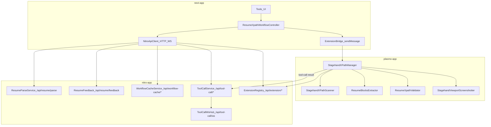

# 01 依赖与分层（Stagehand → mimorepo 三端映射）

本篇回答两个问题：
- **我们要做的产品能力**，在三端分别落在哪里？
- **为什么要这样分层**？（参考 Stagehand v3 的类分层/依赖方向）

> 参考来源：`.refer/docs/stagehand/xpath-generage/` 与 Stagehand v3 源码（`.refer/.sources/stagehand/packages/core/lib/v3/*`）。

## 1) Stagehand v3 的分层原则（抽象总结）
Stagehand v3（仓库里 `Stagehand` 实际是 `V3` 别名）体现了可迁移的分层：
- **门面/编排层（Facade / Orchestrator）**：对外暴露稳定 API，屏蔽环境差异；只负责装配与编排（例如 `V3.act/extract/observe/agent`）。
- **Handler / UseCase 层**：按用例拆分（act/extract/observe/agent handler），独立可替换/可测试。
- **Runtime/Understudy 层**：封装 CDP、Target、Frame、OOPIF 的复杂性（例如 `V3Context` 负责 target 生命周期与页面映射）。
- **Cache 层**：将缓存拆为“存储介质”与“策略逻辑”（`CacheStorage` vs `ActCache/AgentCache`），并强调：
  - **cache hit ≠ 成功**：仍需确定性回放/验证；
  - **自愈后刷新 entry**：回放/执行过程中若 actions/steps 变化，写回 cache（self-heal refresh）。
- **Provider/Adapter 层**：LLM、日志、API 等通过注入解耦，避免策略侵入核心。

迁移到 XPath 场景时：
- “确定性动作”变成 **CDP 可重复工具**（scan/screenshot/validate/digest）。
- “确定性判定”变成 **XPathValidator（matchedCount）**。
- “cache replay 自愈”变成 **WorkflowCache 命中后仍验证，失败时触发修复并 patch**。

## 2) mimorepo 三端架构的分层映射（产品视角）

### 2.1 端与职责
- **next-app（UI + 流程编排）**
  - 负责：用户交互、状态机编排（cache → 采集 → LLM → 验证 → fallback → patch）、可视化与导出。
  - 现有入口：`mimorepo/apps/next-app/app/tools/page.tsx`。

- **plasmo-app（Runtime Tools：确定性工具执行）**
  - 负责：CDP attach、DOM/iframe/OOPIF 处理、扫描、截图、验证；输出“可判定结果”。
  - 现有入口：`mimorepo/apps/plasmo-app/src/background/index.ts`（`StagehandXPathManager`）。

- **nitro-app（LLM + Persist + Broadcast）**
  - 负责：LLM 调用与解析、样本落盘、WorkflowCache、异步截图任务与 WebSocket 广播。
  - 现有端点：`mimorepo/apps/nitro-app/server/routes/api/*`。

### 2.2 依赖方向（必须坚持）
为了保持可替换与可观测，依赖方向要“向下”：
- next-app 只依赖：
  - 插件暴露的 message protocol（`type + payload`）；
  - nitro-app 的 HTTP/WS API。
- plasmo-app 不依赖 next-app；它只实现：
  - runtime 工具动作；
  - （可选）向 nitro-app 上报异步结果（例如截图 tool-call result）。
- nitro-app 不依赖浏览器状态；它只处理：
  - 输入样本（来自 next-app）；
  - 工具结果（来自插件）；
  - 存储与广播。

## 3) 现有“可用依赖图”（已在仓库里跑通）

### 3.1 现有链路（最小闭环）
- **next → 插件（同步）**：`chrome.runtime.sendMessage(extensionId, message)`
  - 封装：`mimorepo/apps/next-app/lib/extension-bridge.ts`
  - 实现：`mimorepo/apps/plasmo-app/src/background/index.ts` 的 `onMessage / onMessageExternal`

- **next → nitro（HTTP）**：
  - `POST /api/resume/parse`：LLM 解析为 `jsonResumeXPath`
  - `POST /api/resume/feedback`：落盘验证反馈
  - `POST /api/workflow-cache/get|put|patch`：WorkflowCache
  - `POST /api/tool-call/request`：创建截图任务

- **插件 → nitro（HTTP）**：
  - `POST /api/tool-call/result`：截图结果落盘 + WS 广播
  - `POST /api/extension/extension-id`：插件启动后注册 extensionId（便于 next-app 选择）

### 3.2 依赖关系（Mermaid）

## 4) “下一步”需要补齐的依赖（对齐 xpath-generage）
文档目标是从“能跑通”走向“可回放/可自愈/可规模化”。按 `.refer/docs/stagehand/xpath-generage/00-index.md` 的建议，关键补齐点是：
- **用 digest 替代/增强 blocks**：从“关键词切块”过渡到“结构化 DOM 摘要（可控体积）”。\n
  对应类：`CdpDomDigestBuilder`（插件端） + `XPathCandidateProvider`（候选边界）。
- **严格候选边界**：LLM 只能从 candidates 选择 XPath（当前 Nitro prompt 已有硬约束，但 candidates 来源仍需更强规范）。
- **WorkflowCache 语义完整化**：cacheKey 的 `PageSignature` 来源、回放失败→自愈→patch 刷新 history/qualityScore。
- **指标采集与回归**：将 06-metrics-and-quality 的指标采集点映射到三端（见 `04-execution-steps.md` 与 `02-types-and-contracts.md`）。

