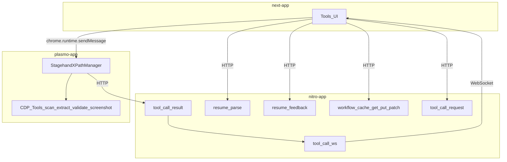
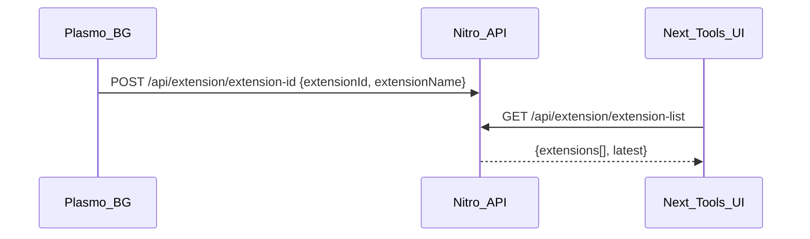
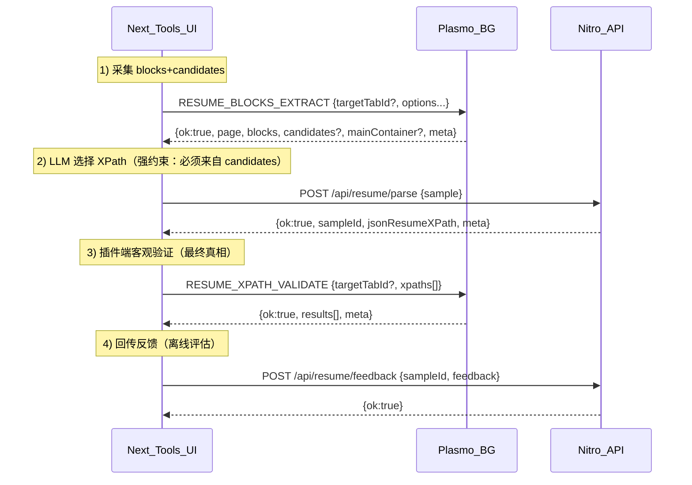
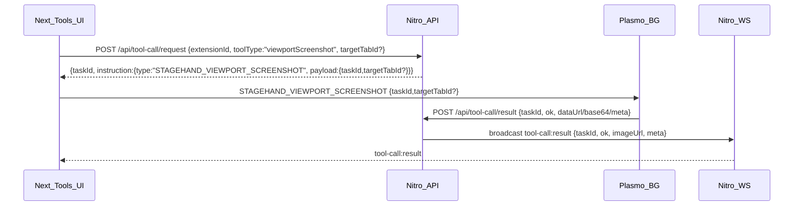
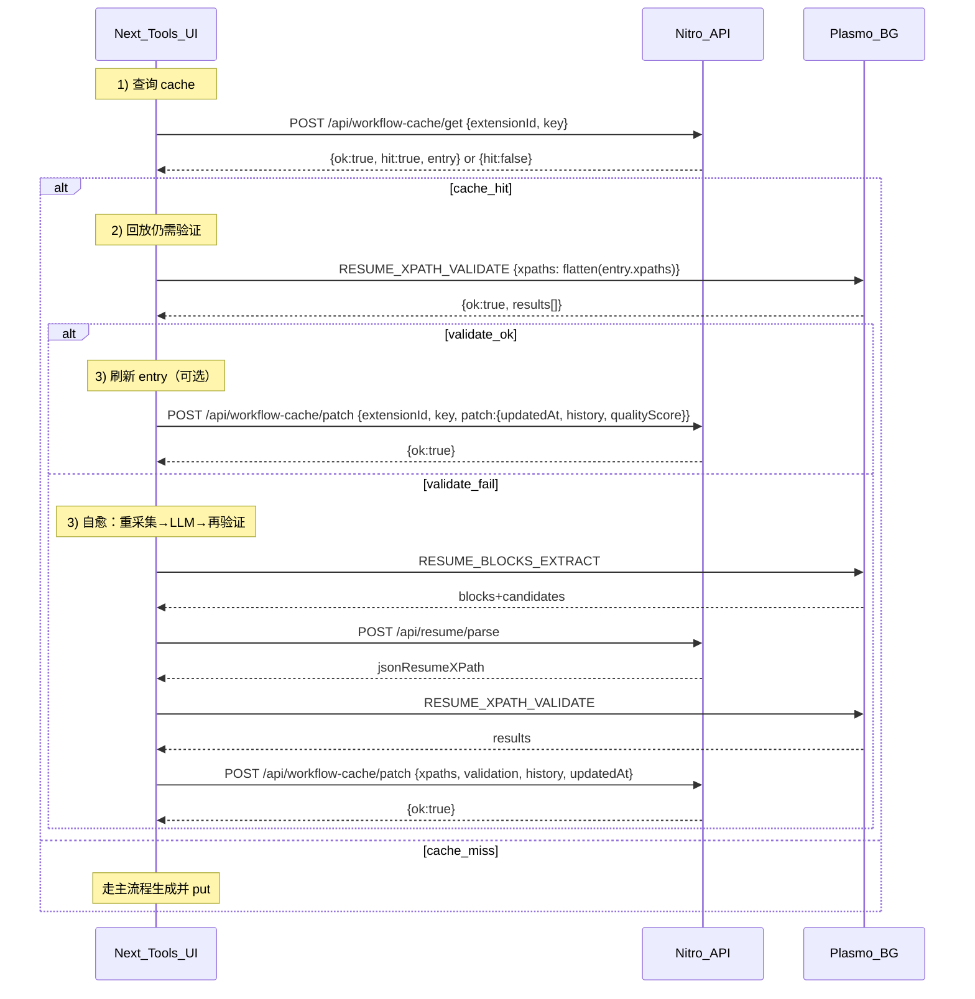

# 03 三端数据流转（插件 + next-app + nitro-app）

本篇用“数据流 + 时序图”把整个产品闭环说清楚：谁在何时产出什么数据、写到哪里、如何回放与自愈。

## 1) 关键参与者
- **Next 工具页**：`mimorepo/apps/next-app/app/tools/page.tsx`
- **插件 Background**：`mimorepo/apps/plasmo-app/src/background/index.ts`
- **Nitro API**：`mimorepo/apps/nitro-app/server/routes/api/*`
- **WorkflowCache Store**：`mimorepo/apps/nitro-app/server/stores/workflowCacheStore.ts`

## 2) 总览：一张图看全链路

## 3) 基础链路：扩展注册与选择
目的：next-app 需要知道要发消息给哪个 `extensionId`。

## 4) 主流程：从页面生成 JSON Resume XPath（PickXPath 优先）
现状实现的“能跑通闭环”基本已经存在于 `Tools` 页面：

### 4.1 关键数据资产
- **sample（用于 LLM）**：`page + candidates + mainContainer?`（当前 prompt 只取 candidates 前 400）
- **validation（用于质量评估）**：字段级 `matchedCount/firstTextSnippet`

## 5) Tool-call 截图链路（异步：请求→执行→回传→ws）
用途：把截图当成“后台异步工具”，并支持 UI 实时展示结果。

**注意**：Nitro 在 `tool-call/result` 会把 base64 落盘到 uploads 并返回 `imageUrl`，避免在 cache/反馈里存大字段。

## 6) WorkflowCache：回放 → 验证 → 自愈 → patch（产品关键闭环）
将 Stagehand v3 的“cache replay + self-heal refresh”迁移到 XPath 任务：\n
**cache 命中不等于成功**，必须再验证；若验证失败必须自愈并 patch 刷新 entry。

## 7) “数据落盘点”一览（用于回归与评估）
- Nitro `sampleStore`：\n
  - `resume/parse` 会落 `sample.json / parse.json / events.jsonl`\n
  - `resume/feedback` 会落 `feedback-<ts>.json / events.jsonl`\n
  - `workflow-cache/put|patch` 会落 `workflow-cache/<cacheId>/...` 与 `events.jsonl`
- Nitro `storage(data)`：WorkflowCache Entry（`workflow-cache:${extensionId}:${cacheId}`）

