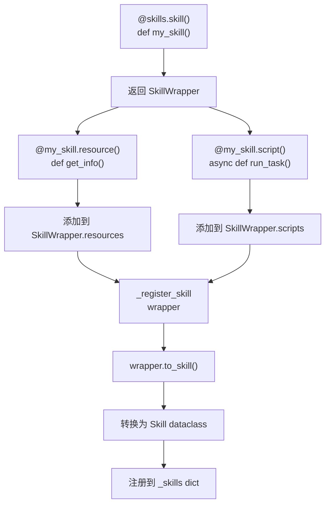
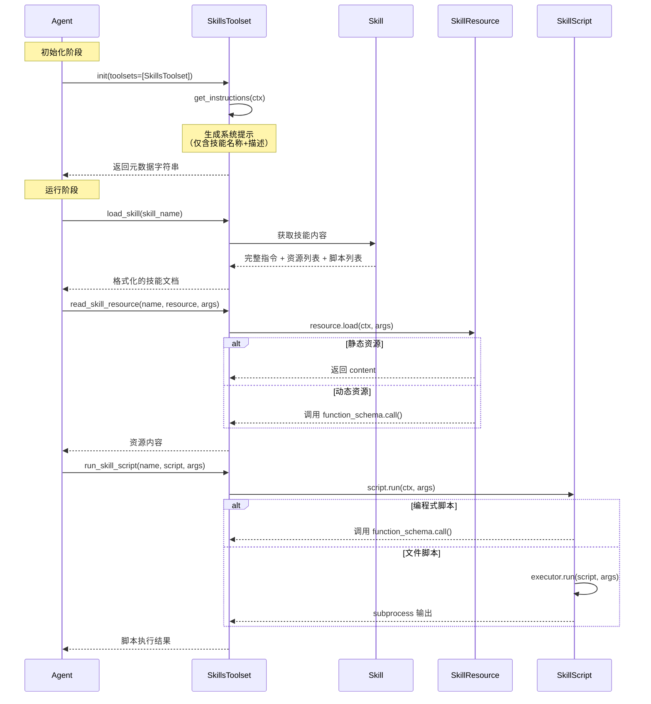

# Pydantic AI Skills 类依赖关系分析

> 基于 [pydantic-ai-skills](../../../.sources/pydantic-ai-skills/) 项目的代码分析

## 目录

- [项目概述](#项目概述)
- [模块结构](#模块结构)
- [类依赖关系图](#类依赖关系图)
- [关键依赖流程](#关键依赖流程)
- [继承关系](#继承关系)
- [异常层次](#异常层次)

---

## 项目概述

**pydantic-ai-skills** 是一个为 Pydantic AI 实现 Anthropic Agent Skills 规范的 Python 库，采用**渐进式披露**机制来减少 token 使用。

核心特性：
- 模块化的技能系统
- 文件系统和编程式两种技能定义方式
- 与 Pydantic AI 的原生集成
- 完整的类型安全支持

---

## 模块结构

```
pydantic_ai_skills/
├── __init__.py          # 公共 API 导出
├── exceptions.py        # 异常层次结构
├── types.py             # 核心数据类定义
├── local.py             # 文件系统实现
├── directory.py         # 技能发现
└── toolset.py           # Pydantic AI 集成层
```

### 模块职责

| 模块 | 职责 | 导出的主要类/函数 |
|------|------|-------------------|
| [`exceptions.py`](../../../.sources/pydantic-ai-skills/pydantic_ai_skills/exceptions.py) | 异常定义 | `SkillException` 及其子类 |
| [`types.py`](../../../.sources/pydantic-ai-skills/pydantic_ai_skills/types.py) | 核心数据类 | `Skill`, `SkillResource`, `SkillScript`, `SkillWrapper` |
| [`local.py`](../../../.sources/pydantic-ai-skills/pydantic_ai_skills/local.py) | 文件系统实现 | `FileBasedSkillResource`, `FileBasedSkillScript`, `LocalSkillScriptExecutor`, `CallableSkillScriptExecutor` |
| [`directory.py`](../../../.sources/pydantic-ai-skills/pydantic_ai_skills/directory.py) | 技能发现 | `SkillsDirectory` |
| [`toolset.py`](../../../.sources/pydantic-ai-skills/pydantic_ai_skills/toolset.py) | Pydantic AI 集成 | `SkillsToolset` |

---

## 类依赖关系图

```
┌─────────────────────────────────────────────────────────────────────────┐
│                           外部依赖                                       │
├─────────────────────────────────────────────────────────────────────────┤
│  pydantic_ai                                                            │
│  ├── FunctionToolset    (基类)                                          │
│  ├── RunContext         (运行上下文)                                     │
│  └── _function_schema   (函数模式生成)                                   │
└─────────────────────────────────────────────────────────────────────────┘
                                    ↓
┌─────────────────────────────────────────────────────────────────────────┐
│                           exceptions.py                                  │
├─────────────────────────────────────────────────────────────────────────┤
│  SkillException (基类)                                                   │
│  ├── SkillNotFoundError                                                │
│  ├── SkillValidationError                                              │
│  ├── SkillResourceNotFoundError                                        │
│  ├── SkillResourceLoadError                                            │
│  └── SkillScriptExecutionError                                         │
└─────────────────────────────────────────────────────────────────────────┘
                                    ↓
┌─────────────────────────────────────────────────────────────────────────┐
│                            types.py                                      │
├─────────────────────────────────────────────────────────────────────────┤
│  normalize_skill_name()        # 工具函数                                │
│                                                                           │
│  @dataclass SkillResource                                              │
│  ├── name: str                                                         │
│  ├── description: str | None                                           │
│  ├── content: str | None    # 静态内容                                  │
│  ├── function: Callable      # 动态内容                                  │
│  ├── function_schema          # Pydantic AI 函数模式                      │
│  ├── uri: str | None          # 文件路径                                  │
│  └── load(ctx, args) → Any    # 加载资源                                 │
│                                                                           │
│  @dataclass SkillScript                                                │
│  ├── name: str                                                         │
│  ├── description: str | None                                           │
│  ├── function: Callable      # 编程式脚本                                │
│  ├── function_schema                                                  │
│  ├── uri: str | None          # 文件路径                                  │
│  └── run(ctx, args) → Any     # 执行脚本                                 │
│                                                                           │
│  @dataclass Skill                                                       │
│  ├── name: str                                                         │
│  ├── description: str                                                   │
│  ├── content: str                                                      │
│  ├── resources: list[SkillResource]                                    │
│  ├── scripts: list[SkillScript]                                        │
│  ├── resource(func) decorator    # 添加资源                             │
│  └── script(func) decorator     # 添加脚本                              │
│                                                                           │
│  @dataclass SkillWrapper[DepsT]  # 装饰器式技能定义                      │
│  ├── function: Callable[[], str]                                        │
│  ├── name: str                                                         │
│  ├── description: str                                                   │
│  ├── resources: list[SkillResource]                                    │
│  ├── scripts: list[SkillScript]                                        │
│  ├── resource(func) decorator                                          │
│  ├── script(func) decorator                                           │
│  └── to_skill() → Skill          # 转换为 Skill                         │
└─────────────────────────────────────────────────────────────────────────┘
                                    ↓
┌─────────────────────────────────────────────────────────────────────────┐
│                            local.py                                       │
├─────────────────────────────────────────────────────────────────────────┤
│  @dataclass FileBasedSkillResource extends SkillResource               │
│  └── load()  # 覆盖：从文件系统加载（JSON/YAML 解析）                    │
│                                                                           │
│  @dataclass FileBasedSkillScript extends SkillScript                   │
│  ├── executor: LocalSkillScriptExecutor | CallableSkillScriptExecutor  │
│  └── run()  # 覆盖：通过 executor 执行                                  │
│                                                                           │
│  class LocalSkillScriptExecutor                                         │
│  ├── timeout: int                                                       │
│  └── run(script, args)  # 使用 anyio.run_process 执行                   │
│                                                                           │
│  class CallableSkillScriptExecutor                                      │
│  ├── _func: Callable                                                    │
│  └── run(script, args)  # 调用封装的函数                                │
│                                                                           │
│  Factory Functions:                                                      │
│  ├── create_file_based_resource(name, uri) → FileBasedSkillResource    │
│  └── create_file_based_script(name, uri, skill_name, executor)         │
│       → FileBasedSkillScript                                            │
└─────────────────────────────────────────────────────────────────────────┘
                                    ↓
┌─────────────────────────────────────────────────────────────────────────┐
│                          directory.py                                     │
├─────────────────────────────────────────────────────────────────────────┤
│  _validate_skill_metadata(frontmatter, instructions) → bool            │
│  _parse_skill_md(content) → (dict, str)                                │
│  _discover_resources(skill_folder) → list[SkillResource]               │
│  _discover_scripts(skill_folder, skill_name, executor)                  │
│      → list[SkillScript]                                                │
│  _discover_skills(path, validate, max_depth, script_executor)          │
│      → list[Skill]                                                      │
│                                                                           │
│  class SkillsDirectory                                                   │
│  ├── path: Path                                                         │
│  ├── validate: bool                                                     │
│  ├── max_depth: int | None                                              │
│  ├── script_executor: LocalSkillScriptExecutor | CallableSkillScriptExecutor │
│  ├── get_skills() → dict[str, Skill]                                    │
│  └── load_skill(skill_uri) → Skill                                      │
└─────────────────────────────────────────────────────────────────────────┘
                                    ↓
┌─────────────────────────────────────────────────────────────────────────┐
│                          toolset.py                                       │
├─────────────────────────────────────────────────────────────────────────┤
│  class SkillsToolset extends FunctionToolset                            │
│  ├── _skills: dict[str, Skill]                                          │
│  ├── _skill_directories: list[SkillsDirectory]                          │
│  ├── _exclude_tools: set[str]                                           │
│  ├── skills: dict[str, Skill]  (property)                               │
│  ├── get_skill(name) → Skill                                            │
│  ├── get_instructions(ctx) → str | None  # 系统提示注入                  │
│  ├── skill(func) decorator → SkillWrapper  # 装饰器式技能定义            │
│  │                                                                     │
│  └── Tools (可选注册):                                                   │
│      ├── list_skills() → dict[str, str]                                │
│      ├── load_skill(skill_name) → str                                   │
│      ├── read_skill_resource(skill_name, resource_name, args) → str    │
│      └── run_skill_script(skill_name, script_name, args) → str         │
└─────────────────────────────────────────────────────────────────────────┘
```

---

## 关键依赖流程

### 1. 文件系统技能加载流程

```mermaid
flowchart TD
    A[SkillsToolset.__init__] --> B[_load_directory_skills]
    B --> C[创建 SkillsDirectory]
    C --> D[SkillsDirectory.get_skills]
    D --> E[_discover_skills]
    E --> F1[_find_skill_files<br/>查找 SKILL.md]
    E --> F2[_parse_skill_md<br/>解析 YAML frontmatter]
    E --> F3[_validate_skill_metadata<br/>验证元数据]
    E --> F4[_discover_resources<br/>→ FileBasedSkillResource[]]
    E --> F5[_discover_scripts<br/>→ FileBasedSkillScript[]]
    F4 --> G[创建 Skill 对象]
    F5 --> G
    G --> H[_register_skill]
    H --> I[添加到 _skills dict]
```

**代码路径**: [`toolset.py:267-299`](../../../.sources/pydantic-ai-skills/pydantic_ai_skills/toolset.py#L267-L299) → [`directory.py:268-352`](../../../.sources/pydantic-ai-skills/pydantic_ai_skills/directory.py#L268-L352)

### 2. 编程式技能定义流程



**代码路径**: [`toolset.py:605-712`](../../../.sources/pydantic-ai-skills/pydantic_ai_skills/toolset.py#L605-L712) → [`toolset.py:714-736`](../../../.sources/pydantic-ai-skills/pydantic_ai_skills/toolset.py#L714-L736)

### 3. 渐进式披露流程



**代码路径**:
- `get_instructions`: [`toolset.py:574-603`](../../../.sources/pydantic-ai-skills/pydantic_ai_skills/toolset.py#L574-L603)
- `load_skill`: [`toolset.py:403-460`](../../../.sources/pydantic-ai-skills/pydantic_ai_skills/toolset.py#L403-L460)
- `read_skill_resource`: [`toolset.py:462-515`](../../../.sources/pydantic-ai-skills/pydantic_ai_skills/toolset.py#L462-L515)
- `run_skill_script`: [`toolset.py:517-572`](../../../.sources/pydantic-ai-skills/pydantic_ai_skills/toolset.py#L517-L572)

---

## 继承关系

```
pydantic_ai.FunctionToolset
    │
    └── SkillsToolset
            │
            ├── SkillsDirectory
            │       └── produces → Skill
            │
            └── Skill
                    │
                    ├── SkillResource
                    │       └── FileBasedSkillResource
                    │
                    └── SkillScript
                            └── FileBasedSkillScript
```

### 类继承详情

| 子类 | 父类 | 代码位置 |
|------|------|----------|
| `SkillsToolset` | `FunctionToolset` | [`toolset.py:74`](../../../.sources/pydantic-ai-skills/pydantic_ai_skills/toolset.py#L74) |
| `FileBasedSkillResource` | `SkillResource` | [`local.py:34`](../../../.sources/pydantic-ai-skills/pydantic_ai_skills/local.py#L34) |
| `FileBasedSkillScript` | `SkillScript` | [`local.py:255`](../../../.sources/pydantic-ai-skills/pydantic_ai_skills/local.py#L255) |

---

## 异常层次

```
Exception
    │
    └── SkillException
            │
            ├── SkillNotFoundError
            ├── SkillValidationError
            ├── SkillResourceNotFoundError
            ├── SkillResourceLoadError
            └── SkillScriptExecutionError
```

### 异常使用场景

| 异常类 | 抛出场景 | 代码位置 |
|--------|----------|----------|
| `SkillNotFoundError` | 技能不存在 | [`toolset.py:262-264`](../../../.sources/pydantic-ai-skills/pydantic_ai_skills/toolset.py#L262-L264) |
| `SkillValidationError` | 元数据验证失败 | [`types.py:59-67`](../../../.sources/pydantic-ai-skills/pydantic_ai_skills/types.py#L59-L67) |
| `SkillResourceNotFoundError` | 资源文件不存在 | [`toolset.py:509-512`](../../../.sources/pydantic-ai-skills/pydantic_ai_skills/toolset.py#L509-L512) |
| `SkillResourceLoadError` | 资源加载失败 | [`local.py:58-66`](../../../.sources/pydantic-ai-skills/pydantic_ai_skills/local.py#L58-L66) |
| `SkillScriptExecutionError` | 脚本执行失败 | [`local.py:165-178`](../../../.sources/pydantic-ai-skills/pydantic_ai_skills/local.py#L165-L178) |

---

## 扩展阅读

- **核心算法详解**：[pydantic-ai-skills-algorithms-zh.md](pydantic-ai-skills-algorithms-zh.md) - 详细的算法实现分析
- **English Version**: [pydantic-ai-skills-algorithms.md](pydantic-ai-skills-algorithms.md) - Core algorithms documentation

---

## 参考

- [pydantic-ai-skills 项目主页](../../../.sources/pydantic-ai-skills/)
- [API 文档](../../../.sources/pydantic-ai-skills/docs/)
- [测试文件](../../../.sources/pydantic-ai-skills/tests/)
