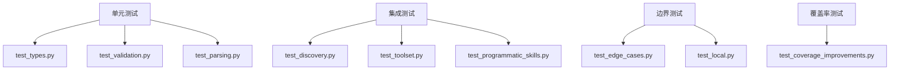

# Pydantic AI Skills 测试用例分析与经验总结

> 基于 [pydantic-ai-skills](../../../.sources/pydantic-ai-skills/) 项目测试代码的深度分析

## 目录

- [测试框架配置](#测试框架配置)
- [测试策略与模式](#测试策略与模式)
- [关键测试场景](#关键测试场景)
- [测试命名规范](#测试命名规范)
- [边界情况测试](#边界情况测试)
- [异步测试模式](#异步测试模式)
- [验证测试模式](#验证测试模式)
- [安全测试模式](#安全测试模式)
- [最佳实践总结](#最佳实践总结)

---

## 测试框架配置

### pytest.ini 配置分析

```ini
[pytest]
testpaths = tests
python_files = test_*.py
python_classes = Test*
python_functions = test_*

# 覆盖率配置
addopts = -v --strict-markers --strict-config
         --cov=pydantic_ai_skills
         --cov-report=term-missing
         --cov-report=html

# 异步测试模式
asyncio_mode = auto  # 自动检测，无需 @pytest.mark.asyncio

# 自定义标记
markers =
    slow: marks tests as slow (deselect with '-m "not slow"')
    integration: marks tests as integration tests
```

### 关键配置解读

| 配置项 | 用途 | 经验 |
|--------|------|------|
| `asyncio_mode = auto` | 自动检测协程函数 | **无需手动添加 `@pytest.mark.asyncio`** |
| `--cov-report=html` | 生成 HTML 覆盖率报告 | 便于可视化查看未覆盖代码 |
| `--strict-markers` | 严格标记模式 | 防止未定义的标记被使用 |

---

## 测试策略与模式

### 1. 测试文件组织结构

```
tests/
├── test_discovery.py          # 技能发现逻辑
├── test_toolset.py            # 工具集核心功能
├── test_types.py              # 数据类基础测试
├── test_programmatic_skills.py # 编程式技能
├── test_validation.py         # 元数据验证
├── test_parsing.py            # YAML 解析
├── test_local.py              # 文件系统和执行器
├── test_edge_cases.py         # 边界情况覆盖
└── test_coverage_improvements.py # 覆盖率改进
```

**组织原则**：
- 每个模块对应独立的测试文件
- `test_edge_cases.py` 专门用于提高覆盖率
- `test_coverage_improvements.py` 针对特定代码路径

### 2. 测试分层策略



---

## 关键测试场景

### 场景 1: 技能发现流程

**测试重点**: 文件系统扫描、YAML 解析、资源发现

```python
def test_discover_skills_multiple_skills(tmp_path: Path) -> None:
    """测试发现多个技能"""
    # 创建技能目录结构
    skill1_dir = tmp_path / 'skill-one'
    skill1_dir.mkdir()
    (skill1_dir / 'SKILL.md').write_text("""---
name: skill-one
description: First skill
---
Content 1.
""")

    skill2_dir = tmp_path / 'skill-two'
    skill2_dir.mkdir()
    (skill2_dir / 'SKILL.md').write_text("""---
name: skill-two
description: Second skill
---
Content 2.
""")

    skills = discover_skills(tmp_path, validate=True)

    assert len(skills) == 2
    skill_names = {s.name for s in skills}
    assert skill_names == {'skill-one', 'skill-two'}
```

**经验点**:
- 使用 `tmp_path` fixture 创建临时目录
- 测试正常场景和多个实体
- 验证返回结果的完整性

### 场景 2: 嵌套深度限制

```python
def test_find_skill_files_depth_one(tmp_path: Path) -> None:
    """测试深度限制"""
    # 根目录技能
    (tmp_path / 'SKILL.md').write_text('...')

    # 一级嵌套
    level1 = tmp_path / 'level1'
    level1.mkdir()
    (level1 / 'SKILL.md').write_text('...')

    # 二级嵌套（不应被 depth=1 找到）
    level2 = level1 / 'level2'
    level2.mkdir()
    (level2 / 'SKILL.md').write_text('...')

    files = _find_skill_files(tmp_path, max_depth=1)

    assert len(files) == 2
```

**经验点**:
- 测试边界值（depth=0, depth=1, None）
- 验证功能正确性而非实现细节

### 场景 3: YAML 解析错误处理

```python
def test_parse_skill_md_invalid_yaml() -> None:
    """测试无效 YAML 处理"""
    content = """---
name: test-skill
description: [unclosed array
---
Content.
"""

    with pytest.raises(SkillValidationError, match='Failed to parse YAML frontmatter'):
        parse_skill_md(content)
```

**经验点**:
- 使用 `pytest.raises` 验证异常类型
- 使用 `match` 参数验证异常消息
- 测试失败场景与成功场景同等重要

---

## 测试命名规范

### 函数命名模式

| 模式 | 用途 | 示例 |
|------|------|------|
| `test_<function>_<scenario>` | 测试特定函数的场景 | `test_parse_skill_md_with_frontmatter` |
| `test_<function>_<edge_case>` | 测试边界情况 | `test_find_skill_files_depth_zero` |
| `test_<class>_<method>_<behavior>` | 测试类方法行为 | `test_toolset_build_resource_xml_with_description` |

### 描述性测试名称

```python
# 好的命名
def test_discover_skills_missing_name_with_validation() -> None:
    """测试验证开启时缺少名称字段的情况"""

def test_local_script_executor_timeout() -> None:
    """测试脚本执行超时"""

# 避免过于简略
def test_timeout() -> None:  # 不够描述性
```

**经验点**:
- 测试名称应描述**测试内容**而非**测试目的**
- 使用 `given_when_then` 风格：`test_<function>_when_<condition>_expect_<result>`

---

## 边界情况测试

### 1. 长度限制边界

```python
def test_normalize_skill_name_exactly_64_chars() -> None:
    """测试正好 64 个字符的技能名称"""
    name_64 = 'a' * 64
    result = normalize_skill_name(name_64)
    assert result == name_64
    assert len(result) == 64


def test_normalize_skill_name_exceeds_64_chars() -> None:
    """测试超过 64 个字符的技能名称"""
    name_65 = 'a' * 65
    with pytest.raises(SkillValidationError, match='exceeds 64 characters'):
        normalize_skill_name(name_65)
```

**经验点**:
- 测试**边界值**（正好限制、超过限制）
- 成功和失败都要测试

### 2. 空值和 None 处理

```python
def test_skill_resource_with_all_none_raises_error() -> None:
    """测试所有可选字段都为 None 时抛出错误"""
    with pytest.raises(ValueError, match='must have either content, function, or uri'):
        SkillResource(name='test')


def test_skill_resource_with_uri_only() -> None:
    """测试仅提供 URI 是有效的"""
    resource = SkillResource(name='test', uri='/path/to/file')
    assert resource.uri == '/path/to/file'
```

**经验点**:
- 测试"全无"情况
- 测试"最小有效"情况

### 3. 错误恢复

```python
@pytest.mark.asyncio
async def test_file_based_resource_load_invalid_json(tmp_path: Path) -> None:
    """测试加载无效 JSON 时回退到文本"""
    skill_dir = tmp_path / 'skill'
    skill_dir.mkdir()

    json_file = skill_dir / 'bad.json'
    json_file.write_text('{ invalid json }')

    resource = FileBasedSkillResource(
        name='bad.json',
        uri=str(json_file),
    )

    content = await resource.load(None)
    # 应返回原始文本
    assert isinstance(content, str)
    assert '{ invalid json }' in content
```

**经验点**:
- 测试**优雅降级**而非硬性失败
- 验证回退行为

---

## 异步测试模式

### 1. 异步函数测试

```python
@pytest.mark.asyncio
async def test_file_based_resource_load_yaml(tmp_path: Path) -> None:
    """测试异步加载 YAML 资源"""
    skill_dir = tmp_path / 'skill'
    skill_dir.mkdir()

    yaml_file = skill_dir / 'config.yaml'
    yaml_file.write_text('key: value\nnumber: 42')

    resource = FileBasedSkillResource(
        name='config.yaml',
        uri=str(yaml_file),
    )

    content = await resource.load(None)
    assert isinstance(content, dict)
    assert content['key'] == 'value'
```

**注意**: 由于 `asyncio_mode = auto`，**不需要** `@pytest.mark.asyncio` 装饰器。

### 2. 同步代码调用异步函数

```python
def test_file_based_resource_load(tmp_path: Path) -> None:
    """测试同步测试中调用异步函数"""
    import asyncio

    resource = FileBasedSkillResource(
        name='REFERENCE.md',
        uri=str(resource_file),
    )

    content = asyncio.run(resource.load(None))
    assert '# Reference' in content
```

**经验点**:
- 少数情况下使用 `asyncio.run()`
- 优先使用 `@pytest.mark.asyncio` 让 pytest 处理

---

## 验证测试模式

### 1. 警告验证

```python
def test_validate_skill_metadata_name_too_long() -> None:
    """测试名称过长时发出警告"""
    frontmatter = {
        'name': 'a' * 65,  # 超过 64 字符
        'description': 'Test',
    }

    with warnings.catch_warnings(record=True) as w:
        warnings.simplefilter('always')
        is_valid = _validate_skill_metadata(frontmatter, 'Content')

        assert is_valid is False
        assert len(w) == 1
        assert '64 characters' in str(w[0].message)
```

**经验点**:
- 使用 `warnings.catch_warnings(record=True)` 捕获警告
- 使用 `warnings.simplefilter('always')` 确保捕获所有警告
- 验证警告数量和内容

### 2. 多个验证问题

```python
def test_validate_skill_metadata_multiple_issues() -> None:
    """测试同时存在多个验证问题"""
    frontmatter = {
        'name': 'A' * 65,      # 太长
        'description': 'x' * 1025,  # 太长
    }
    instructions = '\n'.join([f'Line {i}' for i in range(501)])  # 行数太多

    with warnings.catch_warnings(record=True) as w:
        warnings.simplefilter('always')
        is_valid = _validate_skill_metadata(frontmatter, instructions)

        assert is_valid is False
        assert len(w) >= 3  # 名称、描述、指令长度
```

**经验点**:
- 测试组合场景
- 使用 `>=` 而非 `==` 允许额外警告

### 3. 批量数据驱动测试

```python
def test_validate_skill_metadata_good_naming_conventions() -> None:
    """测试有效的命名约定"""
    good_names = [
        'processing-pdfs',
        'analyzing-spreadsheets',
        'test-skill-123',
        'pdf-processing',
        'skill-1',
    ]

    for name in good_names:
        frontmatter = {'name': name, 'description': 'Test'}
        with warnings.catch_warnings(record=True) as w:
            warnings.simplefilter('always')
            is_valid = _validate_skill_metadata(frontmatter, 'Content')
            assert is_valid is True, f"Name '{name}' should be valid"
            assert len(w) == 0, f"Name '{name}' should not emit warnings"
```

**经验点**:
- 使用循环测试多个输入
- 断言中包含变量名称便于调试
- 覆盖各种有效格式

---

## 安全测试模式

### 1. 路径遍历防护

```python
def test_discover_skills_symlink_escape_detection(tmp_path: Path) -> None:
    """测试检测符号链接逃逸"""
    skill_dir = tmp_path / 'test-skill'
    skill_dir.mkdir()

    # 创建符号链接指向技能目录外
    outside_link = skill_dir / 'escape.md'
    outside_link.symlink_to('/etc/passwd')

    skills = _discover_skills(tmp_path, validate=True)

    # 应该跳过或警告，不应包含恶意文件
    resource_names = [r.name for s in skills for r in (s.resources or [])]
    assert 'escape.md' not in resource_names
```

**经验点**:
- 测试符号链接攻击
- 验证路径解析后仍在安全边界内

### 2. 脚本执行超时

```python
@pytest.mark.asyncio
async def test_local_script_executor_timeout(tmp_path: Path) -> None:
    """测试脚本执行超时"""
    script_file = tmp_path / 'slow_script.py'
    script_file.write_text("""
import time
time.sleep(5)  # 超过超时时间
print("Done")
""")

    executor = LocalSkillScriptExecutor(timeout=1)  # 1 秒超时
    script = FileBasedSkillScript(
        name='slow_script',
        uri=str(script_file),
    )

    with pytest.raises(SkillScriptExecutionError, match='timed out'):
        await executor.run(script)
```

**经验点**:
- 测试资源限制（超时）
- 验证超时后正确抛出异常

### 3. 权限错误处理

```python
def test_discover_skills_os_error_handling(tmp_path: Path) -> None:
    """测试 OS 错误处理"""
    skill_dir = tmp_path / 'skill'
    skill_dir.mkdir()

    skill_md = skill_dir / 'SKILL.md'
    skill_md.write_text('---\nname: test\n---\nContent')

    try:
        skill_md.chmod(0o000)  # 移除读权限

        with pytest.raises(SkillValidationError):
            _discover_skills(tmp_path, validate=False)
    finally:
        skill_md.chmod(0o644)  # 恢复权限便于清理
```

**经验点**:
- 在 `finally` 中清理测试状态
- 测试文件系统权限问题

---

## 最佳实践总结

### 1. Fixture 使用模式

```python
# 创建可复用的测试数据
@pytest.fixture
def sample_skills_dir(tmp_path: Path) -> Path:
    """创建包含示例技能的临时目录"""
    skill1_dir = tmp_path / 'skill-one'
    skill1_dir.mkdir()
    (skill1_dir / 'SKILL.md').write_text("""---
name: skill-one
description: First test skill
---
Use this skill for basic operations.
""")

    skill2_dir = tmp_path / 'skill-two'
    skill2_dir.mkdir()
    (skill2_dir / 'SKILL.md').write_text("""---
name: skill-two
description: Second test skill
---
Advanced skill.
""")
    (skill2_dir / 'FORMS.md').write_text('# Forms\n\nForm guide.')

    return tmp_path
```

### 2. Mock 使用模式

```python
# 最小化 mock - 仅在必要时使用
def test_toolset_get_instructions(sample_skills_dir: Path) -> None:
    """测试系统提示生成"""
    toolset = SkillsToolset(directories=[sample_skills_dir])

    from unittest.mock import Mock
    mock_ctx = Mock()  # get_instructions 不使用 ctx，但需要它

    prompt = await toolset.get_instructions(mock_ctx)
    assert 'skill-one' in prompt
    assert 'skill-two' in prompt
```

### 3. 参数化测试

```python
@pytest.mark.parametrize("name,expected", [
    ("my_cool_skill", "my-cool-skill"),
    ("MySkill", "myskill"),
    ("test_skill_123", "test-skill-123"),
])
def test_normalize_skill_name(name: str, expected: str) -> None:
    """参数化测试技能名称规范化"""
    result = normalize_skill_name(name)
    assert result == expected
```

### 4. 测试隔离

```python
# 每个测试独立创建数据
def test_single_skill(tmp_path: Path) -> None:
    """独立测试单个技能"""
    skill_dir = tmp_path / 'skill'
    skill_dir.mkdir()
    (skill_dir / 'SKILL.md').write_text('...')

    # 不依赖其他测试的状态
    skills = _discover_skills(tmp_path)
    assert len(skills) == 1
```

---

## 测试覆盖率策略

### 1. 覆盖率目标

| 层级 | 目标覆盖率 | 说明 |
|------|-----------|------|
| 核心模块 | >90% | `types.py`, `toolset.py` |
| 工具模块 | >80% | `directory.py`, `local.py` |
| 整体项目 | >85% | 综合覆盖率 |

### 2. 未覆盖代码分析

```python
# test_edge_cases.py 专门用于提高覆盖率
def test_toolset_build_resource_xml_with_callable() -> None:
    """测试带参数的可调用资源 XML 生成"""
    skill = Skill(name='test-skill', description='Test', content='Content')

    @skill.resource
    def get_info(format: str = 'json') -> str:
        """Get information."""
        return 'info'

    toolset = SkillsToolset(skills=[skill])
    resource = skill.resources[0]

    xml = toolset._build_resource_xml(resource)

    assert 'parameters=' in xml  # 验证参数被包含
```

### 3. 覆盖率改进工作流

1. 运行测试并生成报告：`pytest --cov-report=html`
2. 打开 `htmlcov/index.html` 查看未覆盖代码
3. 在 `test_edge_cases.py` 或 `test_coverage_improvements.py` 中添加测试
4. 重复直到达到目标覆盖率

---

## 参考代码位置

| 测试文件 | 测试重点 | 行数参考 |
|----------|----------|----------|
| [test_validation.py](../../../.sources/pydantic-ai-skills/tests/test_validation.py) | 元数据验证 | 全文 |
| [test_parsing.py](../../../.sources/pydantic-ai-skills/tests/test_parsing.py) | YAML 解析 | 全文 |
| [test_local.py](../../../.sources/pydantic-ai-skills/tests/test_local.py) | 文件系统和执行器 | 全文 |
| [test_edge_cases.py](../../../.sources/pydantic-ai-skills/tests/test_edge_cases.py) | 边界情况 | 全文 |
| [test_coverage_improvements.py](../../../.sources/pydantic-ai-skills/tests/test_coverage_improvements.py) | 覆盖率改进 | 全文 |
