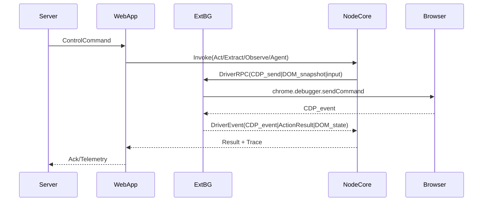

### Verification-First：必须先验证的不确定信息（第一要务）

> 目标：所有结论“必须准确”。因此先把任何存在不确定性的点变成可验证任务；未完成验证前，不做会导致方向性返工的实现。

- **Stagehand 连接层复用性验证**
  - Stagehand v3 的 `understudy/cdp.ts` / `V3Context.create(wsUrl)` 是否硬依赖 WebSocket `wsUrl`（当前结论：是）
  - 是否存在可插拔 transport/注入点能让其复用 `CdpConnection` 上层（需要精读并做最小 PoC）

- **chrome.debugger 作为主链的能力覆盖验证**
  - 扩展侧通过 `chrome.debugger` 是否能稳定覆盖 Stagehand handlers 所需的 CDP 域：`Target/Page/Runtime/DOM/Input/Network`（以及 OOPIF/iframe 场景）
  - attach 生命周期、事件订阅、tab 关闭/切换、background 休眠后的恢复策略

- **DOM 观察复用 Nanobrowser 的可行性验证**
  - Nanobrowser `browser/dom/service.ts` 的注入（`chrome.scripting`）与 iframe fallback 是否可直接作为 `dom.snapshot()` 能力输出
  - 输出结构（elementTree + selectorMap/highlightIndex）是否能满足 Stagehand 的 act/observe/extract（尤其 selector 表达能力：xpath/css/坐标）

- **本地 NodeCore 与扩展通信通道验证**（WebApp 中转下）
  - WebApp→Extension：`externally_connectable` 白名单 + 签名/nonce 防重放的实现方式与浏览器限制
  - WebApp→NodeCore：本地 WS/HTTP vs Native Messaging 的限制（企业环境、端口策略、安装体验）

- **缓存机制落地验证**
  - Stagehand `ActCache/AgentCache` 的 key/replay/self-heal 语义在“扩展驱动”模式下是否仍成立（例如 selector 自愈依赖的 snapshot/selector 稳定性）

完成上述验证后，才能对“复用 Stagehand 哪些部分、需要重写哪些部分”给出可执行且准确的结论。

---

### 原计划（按阶段拆解，已结合 Verification-First）

---
name: Stagehand+Nanobrowser 融合流程拆解
overview: 以“前端页面中转 + 服务器下发指令”为入口，采用 Stagehand 的分层（编排/handlers/cache/LLM）与缓存机制作为 Node 本地核心，同时在扩展侧以 chrome.debugger 为主实现浏览器驱动层（参考 Nanobrowser 的 DOM 注入/iframe fallback/事件流），形成可准确落地的模块拆分与逐步验证路径，并评估 Stagehand 连接层代码可复用范围。
todos: []
---

# 前端页面中转方案：Stagehand 分层+缓存 + Nanobrowser 浏览器交互 的准确拆解计划

## 已确认前提

- **控制入口**：采用“独立前端页面中转”方案，服务器统一下发控制指令。
- **核心运行位置**：`node_local`（Stagehand 分层+缓存机制核心运行在本地 Node 进程）。
- **浏览器驱动方向**：扩展侧优先走 `chrome.debugger`（DevTools Protocol）自封装，而不是复用 Nanobrowser 的 `puppeteer-core ExtensionTransport` 作为主链。

> 这组前提直接决定：Stagehand 的“连接层（基于 wsUrl 的 CDP 连接）”**很难原样复用**，但其“会话/事件路由/协议类型与上层抽象”可能通过**自定义 Transport/适配层**实现复用。

---

## 总体目标架构（高层）

### 目标：一份核心（Node），两份壳（网页/扩展）

- **Node Core（Stagehand 风格）**
  - Orchestrator（类似 `V3`）：统一入口 `act/extract/observe/agent`（或你的业务化 API）
  - Handlers：行为策略层（act/extract/observe/agent）
  - Cache：ActCache/AgentCache（可复用 Stagehand 的 key 构造与 replay 语义）
  - LLM：Provider/Client（可复用 Stagehand 的 provider 思路）
  - Driver Adapter：浏览器驱动抽象（在本方案下不直接连 ws CDP，而是对接扩展 CDP 桥）

- **Extension Adapter（Nanobrowser 风格）**
  - background：接收网页桥接的指令，驱动 `chrome.debugger` attach/发送 CDP、`chrome.scripting` 注入 buildDomTree 等
  - sidepanel（可选）：用于人机监控/确认/调试（即使不用它下发指令，也可作为观察 UI）
  - 事件流：向网页/Node 回传执行事件（类比 Nanobrowser `ExecutionState`）

- **Web App（中转页面）**
  - 与 server 保持 WS/SSE
  - 与扩展建立安全桥接（`externally_connectable` + 签名/nonce）
  - 与本地 Node Core 建立通道（本地 WS/HTTP；或 Native Messaging；择一）

### 建议的事件/数据通路（Mermaid）

---

## 关键问题：能否复用 Stagehand 的“连接”代码？（必须准确）

### 初步结论（基于当前已读代码与运行时约束）

- **Stagehand v3 的 `understudy/cdp.ts` / `V3Context.create(wsUrl)` 是“以 WebSocket 连接 CDP”为核心假设**。
- 在“扩展通过 `chrome.debugger` 连接浏览器”的模式下：
  - **没有可供 Node 直接连接的 `wsUrl`**（除非你额外引入本地代理进程/隧道）。
  - 因此 **Stagehand 的连接层“按原样 ws connect”不可直接复用**。

### 但可复用的部分（需要通过适配达成）

- **可复用 A：会话/事件模型与上层结构**
  - 例如 `CDPSessionLike`、事件路由、`V3Context` 的 target/page 映射思想。
- **可复用 B：协议类型与 handler 逻辑的假设**
  - Stagehand 的 handlers/locator/a11y snapshot 假设能调用 CDP 的 DOM/Runtime/Page/Input 等域。

### 必做验证（保证结论准确）

- 精读并确认 Stagehand 的连接接口假设与可插拔点：
  - `lib/v3/understudy/cdp.ts`（`CdpConnection`/`CdpSession` 如何收发消息、如何注册 event）
  - `lib/v3/understudy/context.ts`（attachToTarget、flatten sessions、event bridge）
- 精读并确认 Nanobrowser 在扩展侧对 CDP 的可达能力：
  - `chrome-extension/src/background/browser/page.ts`（当前走 Puppeteer ExtensionTransport）
  - `chrome-extension/src/background/index.ts`（debugger onDetach、任务取消与 cleanup）
  - 若改为 `chrome.debugger` 主链：确认所需权限、attach 生命周期、事件订阅与 frame/target 覆盖面。

> 只有做完这两组验证，才能对“复用 Stagehand 连接层”的范围给出**可执行且准确**的结论。

---

## 分阶段模块分析与拆解（多步骤，逐步验真）

### Phase 0：定义契约（先定边界，避免后续返工）

- **任务/指令契约**（Server→WebApp→NodeCore）：
  - `Command`：act/extract/observe/agent + options（timeout、model、variables、traceId）
  - `Result`：success/data + metrics + trace
- **驱动契约**（NodeCore→Extension）：
  - `DriverRPC`：
    - `cdp.send(method, params, session?)`
    - `cdp.subscribe(eventFilter)`
    - `dom.snapshot(mode, focusSelector?)`（复用 Nanobrowser buildDomTree 输出结构）
    - `input.click/type/scroll`（可由 CDP Input 域实现）

产出：`docs/architecture/contracts.md`（或内部 RFC）

### Phase 1：Stagehand 分层与缓存机制抽取（不动浏览器实现）

- 从 Stagehand v3 复用/复刻的模块边界：
  - Orchestrator（`V3` 思路）：统一生命周期、metrics、history、cache hook
  - Cache：`ActCache` + `AgentCache` 的 key/record/replay 语义
  - Handler API：act/extract/observe/agent 的输入输出形状

产出：模块接口草图 + cache 行为的验收用例（cache hit、replay、自愈更新）

### Phase 2：扩展侧 CDP Driver（参考 Nanobrowser 的交互特性）

- 目标：在扩展 background 中提供一个“可被 NodeCore 驱动的浏览器能力层”
- 必须覆盖：
  - tab attach/detach、取消与清理（参考 Nanobrowser `debugger.onDetach` 与 `BrowserContext.cleanup`）
  - DOM 注入与 buildDomTree（复用 Nanobrowser `browser/dom/service.ts` 的 iframe fallback 与 selectorMap/highlightIndex）
  - 执行动作：点击、输入、滚动、导航（优先用 CDP Input/Page/Runtime）

产出：driver capability 列表 + 最小可用原型（能：打开页面→取 DOM tree→点击→回读状态）

### Phase 3：连接适配（决定 Stagehand 连接层复用策略）

两条路径二选一（取决于 Phase 2 的 CDP Driver 形态）：

- **路径 3A（推荐）**：Stagehand 使用“DriverRPC”而不是 ws CDP
  - 在 NodeCore 内实现 `BrowserDriver` 接口
  - handlers 调用 driver 提供的 `snapshot/act` 原语
  - 结论：Stagehand 的 `CdpConnection.connect(wsUrl)` 不复用，但 `handlers/cache/LLM` 可最大化复用

- **路径 3B（高复杂）**：做一个“虚拟 CDP Transport”来兼容 Stagehand `CdpConnection`
  - 目标：让 `CdpConnection` 的 send/on/event 绑定到底层 driver（chrome.debugger）
  - 需要：实现与 Stagehand 期待的 transport/event loop 完全一致
  - 结论：可复用更多 Understudy/Context/Page 代码，但工程量与调试复杂度显著更高

产出：复用评估报告（明确：哪些文件可原样用、哪些必须重写、风险点）

### Phase 4：全链路集成（网页中转 + server 下发）

- WebApp 与扩展：
  - `externally_connectable` 白名单域名
  - 消息签名/nonce/过期时间（防重放、跨站伪造）
- WebApp 与 NodeCore：
  - 本地 WS/HTTP（或 Native Messaging）
- Trace：贯穿 server→web→node→ext→browser 的 traceId

产出：端到端时序图 + 失败恢复策略（断线重连、background 休眠、tab 关闭等）

---

## 计划内需要重点阅读/对照的文件（保证准确性）

- Stagehand：
  - `lib/v3/v3.ts`（编排/缓存挂载点）
  - `lib/v3/cache/ActCache.ts`、`lib/v3/cache/AgentCache.ts`
  - `lib/v3/understudy/cdp.ts`、`lib/v3/understudy/context.ts`（连接与事件模型）

- Nanobrowser：
  - `chrome-extension/src/background/index.ts`（port 消息、setupExecutor、清理策略）
  - `chrome-extension/src/background/browser/dom/service.ts`（DOM tree + iframe fallback）
  - `chrome-extension/src/background/browser/page.ts`（当前 puppeteer 方案与可替换点）
  - `chrome-extension/src/background/agent/event/types.ts`（ExecutionState 事件模型）

---

## 实施 TODO（逐步验真，不跳步）

- `contract-spec`
  - 定义三条接口：Server→WebApp、WebApp→NodeCore、NodeCore→Extension DriverRPC
- `stagehand-cache-extract`
  - 抽取/复用 Stagehand 的 cache 与 handler API 形状，写出可验证的行为规范
- `extension-cdp-driver`
  - 设计并验证扩展侧 chrome.debugger driver（含 DOM 注入与动作执行）
- `reuse-evaluation`
  - 基于 Stagehand `CdpConnection` 接口，确定采用路径 3A 还是 3B，并输出可复用文件清单与风险
- `end-to-end-flow`
  - 形成完整时序图与失败恢复策略，确保结论可落地
