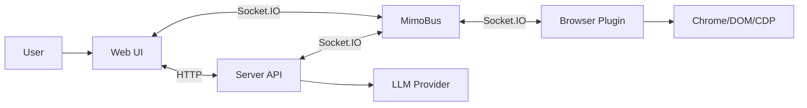

# Mimo 系统精简架构设计（Turbo 版）

本文档定义 Turbo 版 Mimo 的整体架构、模块边界与对外接口（Web / Server / Browser Plugin / LLM）。
目标是保留现有系统的核心链路（聊天 + 浏览器执行 + 数字孪生），同时把端口/协议/职责精简成可落地的 MVP。

## 1. 范围

- **包含**：会话/任务、消息流式、插件选择与确认、浏览器动作执行、Twin 同步、持久化、LLM 工具调用闭环。
- **不包含**：账号/权限体系、支付、多租户、复杂审计、企业级安全加固等。

## 2. 参与系统与职责

- **Web（`apps/web`）**
  - Chat UI、任务列表、插件选择/确认弹窗、Twin（窗口/标签组/标签页）可视化。
  - 通过 HTTP 获取首屏数据/历史记录；通过 Socket 获取实时流式与 Twin 增量。
- **Server（建议新增 `apps/server` 或 `apps/mimoserver`）**
  - 提供 HTTP API（任务/消息/扩展注册/Artifact/Twin 快照）。
  - 提供 Socket Bus（Web ↔ Server、Plugin ↔ Server、Server → Web 的 Twin 推送）。
  - Agent 编排：LLM 调度、browser_action 下发、超时/重试、状态机推进与持久化。
- **Browser Plugin（Chrome MV3 扩展，Plasmo）**
  - 与 Server 建立 Socket 连接并注册 `clientId`。
  - 上报 Twin（full_state_sync + tab_event）。
  - 执行 Server 下发的 `browser_action`（导航/点击/输入/截图/Readability/XPath 扫描等），并回传结果与 artifacts。
- **LLM（外部模型提供方 + Server 内部的 LLM Gateway）**
  - 输出流式文本（chatDelta）与工具调用（browser_action 等）。
  - 由 Server 负责将工具调用落地执行，并将结果回灌给 LLM 继续推理。

## 3. 高层架构与主链路

两条主链路（与既有梳理保持一致但更简化）：

1. **HTTP（Server API）**：任务列表/任务详情/扩展列表/Twin 快照/Artifact；
2. **Socket（MimoBus）**：聊天消息发送与流式回包、插件选择/确认、browser_action 下发与回包、Twin 实时同步。

## 4. 关键设计决策（对齐“精简”目标）

1. **`sessionId == taskId`**：一个聊天会话就是一个任务，减少映射与边界歧义。
2. **HTTP 与 Socket 同源同端口（推荐）**：避免旧系统常见的“HTTP 端口 vs Socket 端口”混用问题。
3. **Server 权威**：任务状态、Twin、插件注册、action 结果都以 Server 为准；Web 只做渲染/交互。
4. **执行统一走总线**：除可选的本地“在线探测”桥接外，Web 不直接调用扩展执行能力。
5. **大 payload 走 Artifact**：截图等二进制不通过 Socket 直传 base64，优先 presigned URL 或 HTTP 上传。

## 5. 文档导航

- `docs/system-design/contracts.md`：HTTP + Socket 接口与消息协议（Web/Server/Plugin）。
- `docs/system-design/agent-runtime.md`：状态机、browser_action catalog、LLM 工具调用闭环与时序。
- `docs/system-design/code-structure.md`：协议到代码结构的落地（Turbo monorepo 目录/模块/命名）。

## 6. 参考输入（已读并合并进设计）

- `docs/state-base-action-tools.md`
- `docs/extensions/2026-02-04-mimoim-mimoserver-data-interactions.md`
- `/Users/soda/Documents/solocodes/mimo/docs/dataflow/2026-02-04-mimoim-plasmo-app-data-interactions.md`
- `/Users/soda/Documents/solocodes/mimo/docs/dataflow/2026-02-04-plasmo-app-analysis.md`
