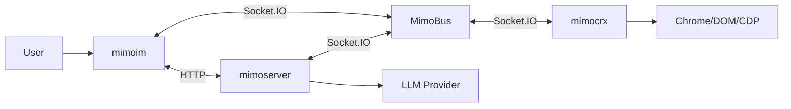

# Mimo 系统精简架构设计（Turbo 版）

本文档定义 Turbo 版 Mimo 的整体架构、模块边界与对外接口（`mimoim` / `mimoserver` / `mimocrx` / LLM）。
目标是保留现有系统的核心链路（聊天 + 浏览器执行 + Snapshot），同时把端口/协议/职责精简成可落地的 MVP。

## 1. 范围

- **包含**：会话/任务、消息流式、浏览器动作执行、Snapshot 同步、持久化、LLM 工具调用闭环。
- **不包含**：账号/权限体系、支付、多租户、复杂审计、企业级安全加固等。

## 2. 项目结构（约定）

```tree
turbo/
├── apps/
│   ├── mimoim/           # ✅ 核心（Web）
│   ├── docs/             # ✅ 核心（文档站点）
│   ├── mimocrx/          # ✅ 核心（Chrome Extension）
│   └── mimoserver/       # ✅ 核心（HTTP + Socket + Agent）
│
└── packages/
    ├── mimo-protocol/    # ✅ 核心（协议单一事实来源）
    ├── mimo-bus/         # ✅ 核心（Socket.IO bus 封装）
    └── mimo-agent/       # ⏸️ 可选（MVP 后期抽包）
```

技术栈与配置：
- 技术栈沿用原项目（Next.js / Socket.IO / Nitro(or Node) / Plasmo）。
- 配置可直接 copy（如 tsconfig 路径、lint/format、Next/Nitro/Plasmo 基础配置），但 import 路径需遵循本仓约定（见“代码引用约定”）。

## 3. 参与系统与职责

- **mimoim（`apps/mimoim`）**
  - Chat UI、任务列表、Snapshot（窗口/标签组/标签页）可视化。
  - 通过 HTTP 获取首屏数据/历史记录；通过 Socket 获取实时流式与 Snapshot 增量。
- **docs（`apps/docs`）**
  - 文档站点（渲染 `turbo/docs/**`），用于对外/对内同步设计与约定。
- **mimoserver（`apps/mimoserver`）**
  - 提供 HTTP API（任务/消息/扩展注册/Artifact/Snapshot）。
  - 提供 Socket Bus（Web ↔ Server、Plugin ↔ Server、Server → Web 的 Snapshot 推送）。
  - Agent 编排：LLM 调度、browser_action 下发、超时/重试、状态机推进与持久化。
- **mimocrx（`apps/mimocrx`，Chrome MV3 扩展，Plasmo）**
  - 与 Server 建立 Socket 连接并注册 `clientId`。
  - 上报 Snapshot（full_state_sync + tab_event）。
  - 执行 Server 下发的 `browser_action`（导航/点击/输入/截图/Readability/XPath 扫描等），并回传结果与 artifacts。
- **packages（`packages/*`）**
  - `mimo-protocol`：协议 types + schema（单一事实来源）。
  - `mimo-bus`：Socket.IO client/server 封装（`frontend_message/frontend_event/plugin_message`）。
  - `mimo-agent`：可选（MVP 后期把 AgentRuntime 抽包复用）。
- **LLM（外部模型提供方 + Server 内部的 LLM Gateway）**
  - 输出流式文本（chatDelta）与工具调用（browser_action 等）。
  - 由 Server 负责将工具调用落地执行，并将结果回灌给 LLM 继续推理。

## 4. 高层架构与主链路



两条主链路（与既有梳理保持一致但更简化）：

1. **HTTP（Server API）**：任务列表/任务详情/扩展列表/Snapshot/Artifact；
2. **Socket（MimoBus）**：聊天消息发送与流式回包、browser_action 下发与回包、Snapshot 实时同步。

## 5. 关键设计决策（对齐“精简”目标）

1. **`chatId == taskId`**：一个聊天会话就是一个任务，减少映射与边界歧义。
2. **HTTP 与 Socket 同源同端口（推荐）**：避免旧系统常见的“HTTP 端口 vs Socket 端口”混用问题。
3. **Server 权威**：任务状态、Snapshot、插件注册、action 结果都以 Server 为准；Web 只做渲染/交互。
4. **执行统一走总线**：除可选的本地“在线探测”桥接外，Web 不直接调用扩展执行能力；无需前端选择或确认插件。
5. **大 payload 走 Artifact**：截图等二进制不通过 Socket 直传 base64，优先 presigned URL 或 HTTP 上传。
6. **代码引用约定**：
   - 当前目录下的子路径：用相对路径（例如 `./lib`）
   - 涉及上级目录：用 alias（例如 `@/lib`），避免 `../..` 链式引用
   - 强约束：业务代码中禁止 `../` import（建议通过 ESLint `no-restricted-imports` 强制）
   - Workspace 包：直接用包名（例如 `mimo-protocol` / `mimo-bus`）

## 6. 部署与集成要点（MVP）

- **HTTP + Socket 同端口**：使用单一 HTTP Server 挂载 Socket.IO，并使用 namespace `/mimo`（同 `contracts.md`），保证 API 与实时总线同源。
- **Next rewrite**：`apps/mimoim` 侧 `/api/*` 统一 rewrite 到 Server（如 `http://localhost:6006/api/:path*`）。
- **反向代理**：生产环境建议由 Nginx/Traefik 将 `/api` 与 `/mimo` 路由到同一 upstream。

示例（单端口 + Socket.IO namespace）：

```ts
const httpServer = createServer(app);
const io = new Server(httpServer, { transports: ["websocket"] });
const mimo = io.of("/mimo");
httpServer.listen(6006);
```

示例（Next rewrite）：

```ts
async rewrites() {
  return [{ source: "/api/:path*", destination: "http://localhost:6006/api/:path*" }];
}
```

## 7. 文档导航

- `docs/system-design/contracts.md`：HTTP + Socket 接口与消息协议（Web/Server/Plugin）。
- `docs/system-design/agent-runtime.md`：状态机、browser_action catalog、LLM 工具调用闭环与时序。
- `docs/system-design/code-structure.md`：协议到代码结构的落地（Turbo monorepo 目录/模块/命名）。

## 8. 参考输入（已读并合并进设计）

- `docs/state-base-action-tools.md`
- `docs/extensions/2026-02-04-mimoim-mimoserver-data-interactions.md`
- `/Users/soda/Documents/solocodes/mimo/docs/dataflow/2026-02-04-mimoim-plasmo-app-data-interactions.md`
- `/Users/soda/Documents/solocodes/mimo/docs/dataflow/2026-02-04-plasmo-app-analysis.md`
