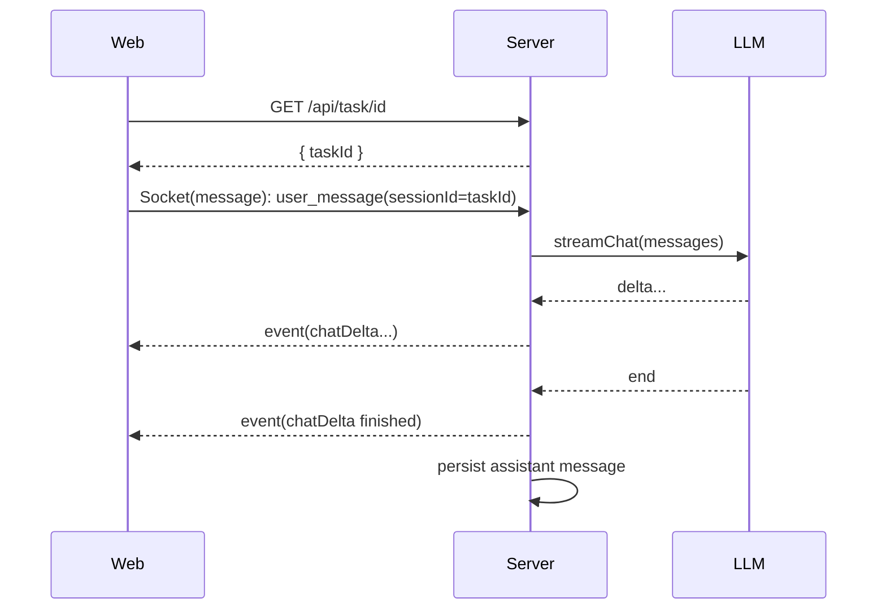
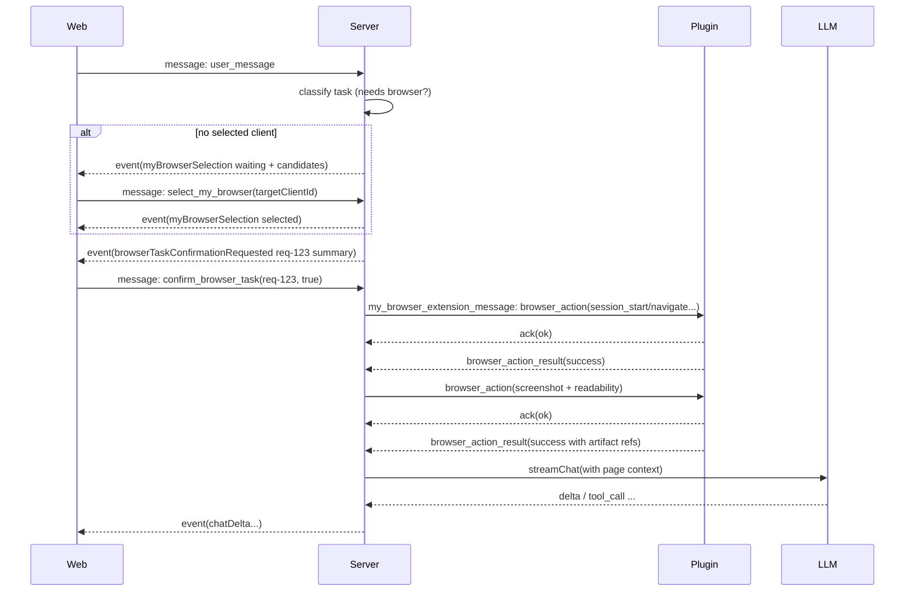

# Agent Runtime（LLM + 状态机 + Browser Actions）

本文档把 `docs/state-base-action-tools.md` 的“基于 state 的 actions tools”抽象成可实现的 **Agent Runtime**：
Server 作为编排器，驱动 LLM 与 Browser Plugin 协作，最终对 Web 端输出可回放的事件流。

---

## 0. 目标（MVP）

- 支持 **聊天流式输出**（chatDelta）。
- 支持 **浏览器任务**（extract / action）：
  - 自动/手动选择插件实例；
  - 执行前用户确认；
  - 固定的“页面准备步骤”（loaded → screenshot + readability）；
  - LLM 依据页面上下文决定下一步 action 或输出结果。
- 支持 **Twin 同步**：Web 能实时看到窗口/标签/组变化与当前活跃 tab。

---

## 1. Server 侧模块划分（建议）

> 这些是代码模块边界（不是网络接口），用于把复杂度收敛到清晰的职责上。

- `SessionStore`
  - 读写 task/session 元数据（title/status/selectedClientId）。
  - 读写消息列表（user/assistant/tool）。
- `ExtensionRegistry`
  - 维护 `clientId` 在线状态与元数据；
  - 提供候选列表给 Web（/api/extension/extension-list）；
  - 维护 session → selected client 的绑定。
- `TwinStore`
  - 接收插件 `full_state_sync` / `tab_event`；
  - 维护权威 Twin 状态；
  - 推送 `twin_state_sync` 给 Web。
- `ArtifactService`
  - 提供 presign/upload/download；
  - 管理截图、HTML、readability 文本等大 payload。
- `ActionScheduler`
  - 对 `sessionId` 做串行队列；
  - 管理 action ack/执行超时；
  - 记录 action 生命周期（start/success/error）。
- `LLMGateway`
  - 统一对接 OpenAI/Anthropic/本地模型；
  - 提供“流式 + 工具调用”抽象；
  - 负责把 LLM 输出映射为 Web event（chatDelta/toolUsed/...）。
- `AgentOrchestrator`
  - 接收 `user_message`；
  - 生成/维护上下文；
  - 驱动 LLM ↔ ToolRunner 闭环；
  - 在需要浏览器动作时协调 `ExtensionRegistry` 与 `ActionScheduler`。

---

## 2. 任务状态机（Task / Session）

在 `docs/state-base-action-tools.md` 的基础上补齐中间态，推荐状态枚举：

- `created`：任务已创建但尚未处理。
- `running`：正在调度 LLM/执行 actions。
- `waiting_for_browser_selection`：需要用户选择插件实例。
- `waiting_for_user_confirmation`：需要用户确认执行浏览器动作。
- `ongoing`：已完成一次关键步骤（例如打开页面并抓取上下文），等待下一轮用户输入或继续调度。
- `completed`：任务完成（输出最终结果）。
- `error`：不可恢复错误（超时、插件离线、执行失败等）。

状态推进关键规则：

1. **同一 session 串行执行**：任何时刻只有一个 action 在执行或等待结果。
2. **每个 action 都必须可观测**：要么收到 ack+result，要么超时进入 error。
3. **页面准备是强约束**：对 extract/action 类任务，必须先得到 screenshot + readability（或明确失败原因）再调用“页面分析 LLM”。

---

## 3. 标准时序（核心链路）

### 3.1 新会话 + 首条消息（无浏览器动作）



### 3.2 浏览器任务（选择 + 确认 + 页面准备）



---

## 4. Browser Actions（工具协议与最小集合）

> 目标：覆盖“页面准备 + 可执行动作”的最小闭环；其余能力可后续增量扩展。

### 4.1 Action 消息骨架

详见 `docs/system-design/contracts.md` 的 `browser_action`。

约束：
- `id` / `actionId` 必须用于幂等；
- 每个 action 必须声明 `sessionId` + `clientId`；
- 推荐 action 参数都显式带 `tabId`（避免隐式“当前 tab”导致错执行）。

### 4.2 Action Catalog（MVP）

> 命名建议使用 `snake_case` 的 actionName（便于与既有扩展/日志对齐），但消息字段仍保持 `camelCase`。

#### A. Session / Tab 相关

- `session_start`
  - params：`{ url?: string, reuseExistingTab?: boolean, groupTitle?: string }`
  - result：`{ tabId: number, windowId: number, groupId?: number, url: string, title?: string }`
- `browser_debugger_attach`
  - params：`{ tabId: number }`
  - result：`{ attached: true }`
- `session_stop`
  - params：`{}`（或 `{ closeTab?: boolean }`）
  - result：`{ stopped: true }`

#### B. 页面准备（强制）

- `browser_wait_for_loaded`
  - params：`{ tabId: number, timeoutMs?: number }`
  - result：`{ status: "complete" }`
- `browser_screenshot`
  - params：`{ tabId: number, fullPage?: boolean }`
  - result：`{ artifactId: string, url: string, width: number, height: number }`
- `browser_readability_extract`
  - params：`{ tabId: number }`
  - result：`{ artifactId?: string, text: string, markdown?: string, title?: string }`

> 说明：readability 文本通常不大，可直接内联；若超过阈值（如 256KB）再写入 artifact 并只返回引用。

#### C. 交互与抽取

- `browser_xpath_scan`
  - params：`{ tabId: number, scope?: "viewport" | "document" }`
  - result：`{ elements: Array<{ xpath: string, tag: string, text?: string, bbox?: { x: number, y: number, w: number, h: number } }> }`
- `browser_click`
  - params：`{ tabId: number, xpath: string }`
  - result：`{ clicked: true }`
- `browser_type`
  - params：`{ tabId: number, xpath: string, text: string, submit?: boolean }`
  - result：`{ typed: true }`
- `browser_get_html`
  - params：`{ tabId: number, xpath?: string }`
  - result：`{ artifactId: string, url: string }`

### 4.3 安全与策略（插件侧必须实现）

为避免“在指令 UI 页”误执行（旧系统已有同类策略），插件侧建议强制：

1. Session 动作只能在 **session 专用 tab** 上执行；
2. 若目标 tab URL 命中 `externally_connectable.matches`（例如 Web UI 的域），则拒绝执行并返回 error；
3. 默认不抢焦点（优先 CDP 注入/后台执行）。

---

## 5. LLM Gateway（接口抽象与事件映射）

LLM 在该设计中不直接对外暴露网络接口，而是 Server 内部抽象：

```ts
export type LlmDelta = { type: "delta"; content: string };
export type LlmToolCall = { type: "tool_call"; toolCallId: string; name: string; arguments: unknown };
export type LlmDone = { type: "done" };
export type LlmEvent = LlmDelta | LlmToolCall | LlmDone;

export interface LlmGateway {
  streamChat(input: {
    sessionId: string;
    messages: Array<{ role: "system" | "user" | "assistant" | "tool"; content: string }>;
    tools: Array<{ name: string; description: string; schema: unknown }>;
    context?: { twin?: unknown; page?: unknown };
  }): AsyncIterable<LlmEvent>;
}
```

事件映射建议：

- `LlmDelta` → Web `chatDelta(delta.content)`；
- `LlmToolCall(name=browser_action)` → `toolUsed(start)` +（必要时）`browserTaskConfirmationRequested` + 下发 `browser_action`；
- Tool result 回灌 LLM 后继续 `streamChat`，直到 `done`；
- 任何不可恢复错误 → Web `structuredOutput(status=error, error=...)` + task.status=`error`。
