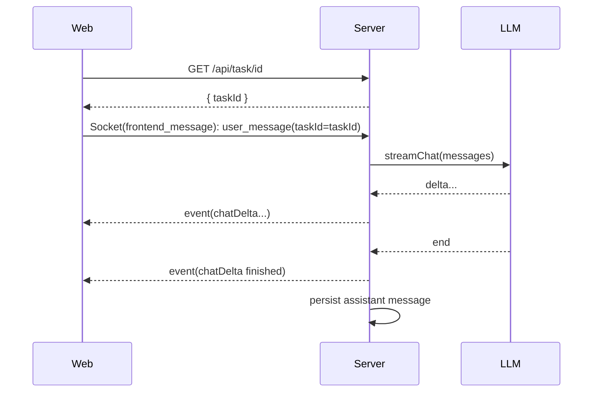
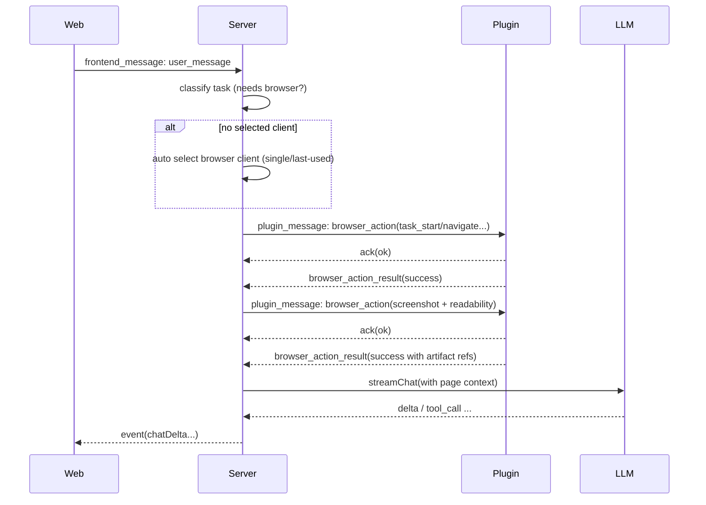

# Agent Runtime（LLM + 状态机 + Browser Actions）

本文档把 `docs/state-base-action-tools.md` 的“基于 state 的 actions tools”抽象成可实现的 **Agent Runtime**：
Server 作为编排器，驱动 LLM 与 Browser Plugin 协作，最终对 Web 端输出可回放的事件流。

在 Turbo 项目结构中：
- Web = `apps/mimoim`
- Server = `apps/mimoserver`
- Browser Plugin = `apps/mimocrx`

---

## 0. 目标（MVP）

- 支持 **聊天流式输出**（chatDelta）。
- 支持 **浏览器任务**（extract / action）：
  - 系统自动选择插件实例（优先已连接/最近使用；无可用实例则返回错误并提示连接插件）；
  - 固定的“页面准备步骤”（loaded → screenshot + readability）；
  - LLM 依据页面上下文决定下一步 action 或输出结果。
- 支持 **Snapshot 同步**：Web 能实时看到窗口/标签/组变化与当前活跃 tab。
- 与 Manus 风格对齐的**后台执行 + CDP 注入**：点击/输入默认走 CDP，避免显式切换到前台 tab。

---

## 1. Server 侧模块划分（建议）

> 这些是代码模块边界（不是网络接口），用于把复杂度收敛到清晰的职责上。

- `TaskStore`
  - 读写 task/task 元数据（title/status/selectedClientId）。
  - 读写消息列表（user/assistant/tool）。
- `ExtensionRegistry`
  - 维护 `clientId` 在线状态与元数据；
  - 提供候选列表给 Web（/api/extension/extension-list）；
  - 维护 task → selected client 的绑定；
  - 在无显式选择时执行**自动选择**（单实例直选/最近使用优先）。
- `SnapshotStore`
  - 接收插件 `full_state_sync` / `tab_event`；
  - 维护权威 Snapshot 状态；
  - 通过 `frontend_event` 推送 `snapshotSync` 给 Web。
- `ArtifactService`
  - 提供 presign/upload/download；
  - 管理截图、HTML、readability 文本等大 payload。
- `ActionScheduler`
  - 对 `taskId` 做串行队列；
  - 管理 action ack/执行超时；
  - 记录 action 生命周期（start/success/error）。
- `LLMGateway`
  - 统一对接 OpenAI/Anthropic/本地模型；
  - 提供“流式 + 工具调用”抽象；
  - 负责把 LLM 输出映射为 Web event（chatDelta/toolUsed/...）。
- `AgentOrchestrator`
  - 接收 `user_message`；
  - 生成/维护上下文；
  - 驱动 LLM ↔ ToolRunner 闭环；
  - 在需要浏览器动作时协调 `ExtensionRegistry` 与 `ActionScheduler`。

---

## 2. 状态机约定（Server Task + Plugin UI）

在 `docs/state-base-action-tools.md` 的基础上补齐中间态，并与 Manus 的 UI 状态机对齐。

### 2.1 Task 状态（Server）

推荐状态枚举：

- `created`：任务已创建但尚未处理。
- `running`：正在调度 LLM/执行 actions。
- `ongoing`：已完成一次关键步骤（例如打开页面并抓取上下文），等待下一轮用户输入或继续调度。
- `takeover`：用户接管浏览器，自动化暂停（对齐 Manus 的 Takeover）。
- `completed`：任务完成（输出最终结果）。
- `error`：不可恢复错误（超时、插件离线、执行失败等）。

状态推进关键规则：

1. **同一 task 串行执行**：任何时刻只有一个 action 在执行或等待结果。
2. **每个 action 都必须可观测**：要么收到 ack+result，要么超时进入 error。
3. **页面准备是强约束**：对 extract/action 类任务，必须先得到 screenshot + readability（或明确失败原因）再调用“页面分析 LLM”。
4. **用户接管即暂停**：插件侧检测到用户输入/鼠标操作时，上报“接管”事件，Server 将任务状态置为 `takeover` 并停止继续调度 action，直到用户显式恢复。

### 2.2 插件 UI 状态（Manus 对齐）

Content Script 维护与 Manus 对齐的 4 态 UI 状态机（用于遮罩与交互引导）：

- `idle`：无活动任务，无遮挡，用户正常操作。
- `hidden`：任务在后台运行或被挂起，UI 隐藏（不抢焦点）。
- `ongoing`：AI 正在控制浏览器，显示遮罩与状态提示。
- `takeover`：用户接管，显示“恢复/停止”按钮，允许用户操作。

与 Server Task 的对齐建议：

- `running`/`ongoing` 且当前有 action 执行 → UI 进入 `ongoing`。
- 后台执行且无需提示 → UI 进入 `hidden`。
- 用户任意输入导致接管 → Server 置 `takeover`，UI 进入 `takeover`。
- 任务结束或无任务 → UI 回到 `idle`。

---

## 3. 标准时序（核心链路）

### 3.1 新会话 + 首条消息（无浏览器动作）



### 3.2 浏览器任务（自动选择 + 页面准备）



---

## 4. Browser Actions（工具协议与最小集合）

> 目标：覆盖“页面准备 + 可执行动作”的最小闭环；其余能力可后续增量扩展。

### 4.1 Action 消息骨架

详见 `docs/system-design/contracts.md` 的 `browser_action`。

约束：
- `id` / `actionId` 必须用于幂等；
- 每个 action 必须声明 `taskId` + `clientId`；
- 推荐 action 参数都显式带 `tabId`（避免隐式“当前 tab”导致错执行）。

### 4.2 Action Catalog（MVP）

> 命名建议使用 `snake_case` 的 actionName（便于与既有扩展/日志对齐），但消息字段仍保持 `camelCase`。

#### A. Task / Tab 相关

- `task_start`
  - params：`{ url?: string, reuseExistingTab?: boolean, groupTitle?: string }`
  - result：`{ tabId: number, windowId: number, groupId?: number, url: string, title?: string }`
- `browser_debugger_attach`
  - params：`{ tabId: number }`
  - result：`{ attached: true }`
- `task_stop`
  - params：`{}`（或 `{ closeTab?: boolean }`）
  - result：`{ stopped: true }`

#### B. 页面准备（强制）

- `browser_wait_for_loaded`
  - params：`{ tabId: number, timeoutMs?: number }`
  - result：`{ status: "complete" }`
- `browser_screenshot`
  - params：`{ tabId: number, fullPage?: boolean }`
  - result：`{ artifactId: string, url: string, width: number, height: number }`
- `browser_readability_extract`
  - params：`{ tabId: number }`
  - result：`{ artifactId?: string, text?: string, markdown?: string, title?: string, contentLengthBytes?: number, truncated?: boolean }`

> 说明：readability 文本通常不大，可直接内联；当 **UTF-8 字节数 ≥ 256KB** 时仅返回 `artifactId`（`text/markdown` 置空），并标记 `truncated=true`（阈值用于控制 LLM 上下文与 Socket payload 规模）。超过 2MB 直接返回错误 `READABILITY_TOO_LARGE`。

#### C. 交互与抽取

- `browser_dom_index`
  - params：`{ tabId: number, scope?: "viewport" | "document", assignAttr?: string }`
  - result：`{ elements: Array<{ clickId: number, tag: string, text?: string, xpath?: string, bbox?: { x: number, y: number, w: number, h: number } }> }`
  - 说明：默认注入 `data-mimo_click_id`（可通过 `assignAttr` 覆盖）。此设计对齐 Manus 的 `data-manus_click_id`，用于稳定索引与 LLM 选择。
- `browser_xpath_scan`
  - params：`{ tabId: number, scope?: "viewport" | "document" }`
  - result：`{ elements: Array<{ xpath: string, tag: string, text?: string, clickId?: number, bbox?: { x: number, y: number, w: number, h: number } }> }`
- `browser_click`
  - params：`{ tabId: number, clickId?: number, xpath?: string, strategy?: "cdp_mouse" | "dom_click" }`
  - result：`{ clicked: true, strategy: "cdp_mouse" | "dom_click" }`
  - 说明：默认 `strategy=cdp_mouse`，通过 CDP 注入 `Input.dispatchMouseEvent` 发送 `mousePressed + mouseReleased`，以获得更接近真实用户的事件特征（`isTrusted`）。
- `browser_type`
  - params：`{ tabId: number, xpath?: string, clickId?: number, text: string, submit?: boolean, strategy?: "cdp_key" | "dom_input" }`
  - result：`{ typed: true, strategy: "cdp_key" | "dom_input" }`
- `browser_get_html`
  - params：`{ tabId: number, xpath?: string }`
  - result：`{ artifactId: string, url: string }`

### 4.3 安全与策略（插件侧必须实现）

为避免“在指令 UI 页”误执行（旧系统已有同类策略），插件侧建议强制：

1. Task 动作只能在 **task 专用 tab** 上执行；
2. 若目标 tab URL 命中 `externally_connectable.matches`（例如 Web UI 的域），则拒绝执行并返回 error；
3. 默认不抢焦点（优先 CDP 注入/后台执行）。
4. 若使用 CDP，允许在后台标签页执行：可调用 `window.focus()` 让文档获得焦点但不切换 tab，使 `visibilityState` 仍保持为 `hidden`（对齐 Manus 的“后台点击”特性）。

### 4.4 Manus 对齐的实现细节（建议）

- **CDP 输入事件优先**：点击走 `Input.dispatchMouseEvent`（`mousePressed` + `mouseReleased`），键盘输入走 `Input.dispatchKeyEvent`，避免 `element.click()` 的可检测痕迹。
- **索引化点击目标**：优先走 `browser_dom_index` 的 `clickId`（等价 Manus 的 `data-manus_click_id`），XPath 仅作为回退路径。
- **无前台切换**：任务执行期不做 `chrome.tabs.update({ active: true })`，避免 UI 抢焦点；必要时通过文档 `focus` + CDP 完成交互。

### 4.5 页面准备失败处理（MVP）

- `browser_screenshot` / `browser_readability_extract` 各自最多重试 **1 次**（退避 500ms → 1500ms）。
- 仅有一项失败：继续执行，并在工具结果中返回 `warnings` 与 `missing`（例如 `missing: ["screenshot"]`）。
- 两项都失败：返回 `PAGE_PREP_FAILED`（`retryable=true`），任务进入 `error`。

### 4.6 CDP 降级策略（MVP）

- `browser_debugger_attach` 失败或 CDP 调用报错 → 自动降级到 DOM 策略（`strategy=dom_click/dom_input`），并在结果中返回 `warnings`。
- 若显式要求 `strategy=cdp_*` 且降级失败，返回 `CDP_UNAVAILABLE`。
- 对不支持 CDP 的浏览器，默认走 DOM 策略并提示降级原因。

### 4.7 Task 专用 Tab 识别（MVP）

- `task_start` 返回的 `tabId` 作为 **task 专用 tab** 标识；插件侧维护 `taskId → tabId` 映射。
- 插件收到 `browser_action` 时必须校验 `tabId`，不匹配则返回 `INVALID_TASK_TAB`。
- 若 tab 被用户关闭，插件返回 `TASK_TAB_CLOSED`，Server 需重新 `task_start` 创建新 tab。

---

## 5. LLM Gateway（接口抽象与事件映射）

LLM 在该设计中不直接对外暴露网络接口，而是 Server 内部抽象：

```ts
export type LlmDelta = { type: "delta"; content: string };
export type LlmToolCall = {
  type: "tool_call";
  toolCallId: string;
  name: string;
  arguments: Record<string, unknown>; // 已解析的 JSON arguments
};
export type LlmError = { type: "error"; code: string; message: string; retryable?: boolean };
export type LlmDone = { type: "done" };
export type LlmEvent = LlmDelta | LlmToolCall | LlmDone | LlmError;

export interface LlmGateway {
  streamChat(input: {
    taskId: string;
    messages: Array<{ role: "system" | "user" | "assistant" | "tool"; content: string }>;
    tools: Array<{ name: string; description: string; schema: unknown }>;
    context?: { snapshot?: unknown; page?: unknown };
    timeoutMs?: number; // 默认 90s
  }): AsyncIterable<LlmEvent>;
}
```

Tool result（回灌 LLM 的 `tool` role 内容）约定：

```json
{
  "toolCallId": "call-1",
  "name": "browser_action",
  "ok": true,
  "result": {},
  "warnings": []
}
```

失败时：

```json
{
  "toolCallId": "call-1",
  "name": "browser_action",
  "ok": false,
  "error": { "code": "PAGE_PREP_FAILED", "message": "screenshot/readability failed", "retryable": true }
}
```

事件映射建议：

- `LlmDelta` → Web `chatDelta(delta.content)`；
- `LlmToolCall(name=browser_action)` → `toolUsed(start)` + 直接下发 `browser_action`；
- Tool result 回灌 LLM 后继续 `streamChat`，直到 `done`；
- `LlmError` → Web `structuredOutput(status=error, error=...)` + task.status=`error`。

### 5.1 错误分类（MVP）

- **可重试（`retryable=true`）**：`PLUGIN_OFFLINE`、`PLUGIN_TIMEOUT_ACK/EXEC`、`PAGE_PREP_FAILED`、`CDP_UNAVAILABLE`。
- **不可重试**：`INVALID_TASK_TAB`、`INVALID_TARGET`、`READABILITY_TOO_LARGE`、`SCHEMA_VALIDATION_FAILED`。
- **部分成功**：返回 `status=partial` + `warnings`，调度器继续执行后续动作。
- **重试策略**：仅对 `retryable=true` 的错误 **最多重试 1 次**（退避 1s），否则直接失败。
